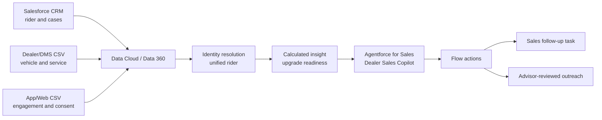

# SVT Motors Data Cloud + Agentforce demo

## 1. Purpose

Build a small, synthetic-data demo showing how a two-wheeler manufacturer could use Salesforce Data Cloud (now branded Data 360) and Agentforce for Sales to give a dealer sales advisor a unified customer view and recommend the next best follow-up.

**SVT Motors is a fictional company used only for this demo.** The scenario is inspired by the Salesforce automotive customer story cited in the Sources section. Its **Products Used** section lists **Data Cloud, Agentforce for Sales, and Marketing Cloud**. The story also says Data Cloud integrates data from multiple systems into a 360-degree customer view for contextual, personalized, real-time, omnichannel experiences.

The reference page confirms the products, but it does not publish the customer's detailed Agentforce topics, actions, data model, prompts, or architecture. The SVT Motors workflow below is therefore a fictional, plausible product-aligned demo.

## 2. Recommended demo story

### Scenario: Dealer Sales and Retention Copilot

A dealer sales advisor is preparing to contact an existing rider who recently engaged with an upgrade campaign and asks:

> "Why is this rider a good follow-up candidate, and what should I discuss?"

The Agentforce agent:

1. Identifies the rider using a synthetic phone number or email address.
2. Retrieves the unified profile from Data Cloud.
3. Summarizes the rider's vehicle ownership, service history, consent, and recent Marketing Cloud-style engagement.
4. Retrieves a transparent upgrade-readiness signal computed in Data Cloud.
5. Suggests relevant, approved discussion points without inventing an offer.
6. Creates a sales follow-up task or draft outreach for advisor review.

### Business value illustrated

- One customer view across CRM, dealer, service, and engagement systems
- More relevant and consistent sales conversations
- Reduced research time for dealer sales staff
- Retention and upgrade opportunities based on governed signals
- Human-reviewed personalization across sales and marketing touchpoints
- Governed AI actions with consent checks and human escalation

## 3. Which Salesforce org is needed?

### Best option for this small demo

Use a **new Salesforce Developer Edition that explicitly includes Agentforce and Data 360**:

- Sign-up page: <https://developer.salesforce.com/signup>
- Salesforce describes this edition as a free development environment with Agentforce and Data 360.
- It is suitable for synthetic data, an internal proof of concept, Agent Builder testing, Flows, Prompt Builder, and Data Cloud profile unification.

Do not assume an older Developer Edition or a normal Trailhead Playground has the required entitlements. Create a new org from the current Developer Edition sign-up page and verify the features listed below.

### Org readiness checklist

In Setup, confirm:

- **Data Cloud Setup Home** is available and Data Cloud/Data 360 can be enabled.
- **Einstein Setup** is enabled.
- **Agentforce Agents** or **Agents** is available and Agentforce can be enabled.
- Your admin user has Data Cloud and Agentforce administration permissions.
- An agent runtime user is available and has least-privilege access to the required objects, Flows, Apex classes, and data.

Salesforce's Agentforce DX guidance allows a Developer Edition with Agentforce and Data 360. It recommends a Data Cloud-capable sandbox for more representative Data Cloud and Agentforce development.

### When to use another org

| Need | Recommended org |
|---|---|
| Small, internal, synthetic-data demo | New Agentforce + Data 360 Developer Edition |
| Short guided exercise with preloaded sample data | The special Developer Edition linked by that specific Trailhead exercise |
| Integration with a customer's production data sources | Data Cloud-enabled sandbox connected to the production org |
| Real customer-facing web/mobile channel, realistic security, scale, or deployment testing | Licensed Enterprise/Unlimited production org plus a Data Cloud-capable sandbox |

Developer Edition limits and included consumption can change. Confirm credits, supported channels, and feature entitlements before promising a public-facing demo. A Builder preview or internal employee-facing agent is the safest initial scope.

## 4. Demo scope

### In scope

- Synthetic rider, vehicle, service, dealer, and engagement data
- Two source files or simulated source systems
- Identity resolution into a unified rider profile
- One calculated upgrade-readiness signal
- One Agentforce agent with three or four actions
- Sales follow-up Task creation in Salesforce
- Human handoff for uncertain or restricted requests

### Out of scope

- Real customer data, trademarks, or branding presented as part of the fictional SVT Motors implementation
- Live vehicle telemetry
- Payment, financing, roadside emergency handling, or safety diagnosis
- Production WhatsApp, telephony, website, or dealer-management-system integration
- Predictive maintenance models
- Autonomous warranty approval or safety-critical advice

## 5. Proposed architecture

For the smallest demo, ingest CSV files into Data Cloud and retain Leads/Contacts and follow-up Tasks in Salesforce CRM. Represent Marketing Cloud engagement with synthetic campaign-event CSV data if Marketing Cloud is not provisioned in the demo org. This demonstrates the data-to-action pattern without requiring external middleware.

## 6. Synthetic data design

Use fictional names, phone numbers, emails, VIN-like identifiers, and dealer details. Add a visible `DEMO DATA` marker to records.

### Source A: CRM riders

[`riders.csv`](svt-demo-data/riders.csv)

| Field | Example | Purpose |
|---|---|---|
| customer_id | SVT-1001 | Source key |
| first_name | Ananya | Profile |
| last_name | Rao | Profile |
| email | ananya.rao@example.test | Identity match |
| phone | +91-9000001001 | Identity match |
| city | Bengaluru | Dealer selection |
| preferred_language | English | Personalization |
| contact_permission | true | Action guardrail |

### Source B: dealer and service history

[`vehicle_service_history.csv`](svt-demo-data/vehicle_service_history.csv)

| Field | Example | Purpose |
|---|---|---|
| service_visit_id | SVT-SVC-5001 | Event key |
| customer_id | SVT-1001 | Relationship |
| vehicle_id | SVT-VEH-2001 | Vehicle relationship |
| vehicle_model | SVT Stride 200 Demo | Context |
| vehicle_registration_date | 2024-08-12 | Context |
| last_service_date | 2026-01-20 | Due calculation |
| last_service_odometer_km | 7200 | Due calculation |
| current_odometer_km | 10400 | Due calculation |
| warranty_end_date | 2028-04-14 | Context |
| preferred_dealer | SVT Bengaluru Central | Recommendation |

### Source C: engagement

[`digital_engagement.csv`](svt-demo-data/digital_engagement.csv)

| Field | Example | Purpose |
|---|---|---|
| engagement_id | SVT-ENG-9001 | Event key |
| customer_id | SVT-1001 | Relationship |
| event_type | ModelPageViewed | Intent signal |
| event_timestamp | 2026-08-16T10:30:00Z | Recency |
| channel | MobileApp | Context |

### Suggested Data Cloud mapping

- Rider source record → Individual
- Email and phone → Contact Point Email and Contact Point Phone
- Vehicle source record → a vehicle/asset DMO available in the org, or a small custom DMO
- Service record → a custom Service Visit DMO
- Engagement record → an engagement DMO

Use `customer_id` for deterministic reconciliation in the demo, with normalized email and phone as additional match rules. Keep identity rules intentionally simple and explain that production rules need data-quality analysis and governance.

### Data Cloud import steps

1. In **Data Cloud**, open **Data Streams** and select **New**.
2. Choose **File Upload** and import the three files from [`svt-demo-data`](svt-demo-data/):
   - `riders.csv`
   - `vehicle_service_history.csv`
   - `digital_engagement.csv`
3. Use `customer_id` as each source's primary key. Keep `email` and `phone` on all three sources for identity matching.
4. Map rider profile fields to **Individual**, **Contact Point Email**, and **Contact Point Phone**. Map vehicle/service fields to the available vehicle and engagement/service DMOs; use a custom DMO only where the standard model does not fit.
5. Configure identity resolution with `customer_id` as the deterministic match rule. Add normalized email and phone as supporting rules.
6. Run the data streams and identity rules. Confirm that Ananya (`ananya.rao@example.test`) resolves to a single profile with a vehicle/service record and two digital engagement events.
7. Keep Meera's `contact_permission` as `false`; it is the negative test for the Agentforce follow-up action.

The files are synthetic. Do not upload production customer records to this Developer Edition.

### Calculated insight

Create an `Upgrade_Readiness` insight using transparent demo weights:

- Add points when the vehicle has been owned for a configured demo period.
- Add points for recent model-page, configurator, or upgrade-campaign engagement.
- Add points for an upcoming lifecycle milestone.
- Set `HIGH`, `MEDIUM`, or `LOW` from the total score.

The weights and thresholds are illustrative SVT Motors demo logic only. Production eligibility, pricing, and offer rules must come from authorized business teams and be tested for fairness and compliance.

## 7. Agentforce design

### Agent

**Name:** Dealer Sales and Retention Copilot

**Role:** Help an authorized sales advisor understand rider context, explain a demo upgrade-readiness signal, and create a follow-up task for advisor review.

**Channel for v1:** Agent Builder preview or an internal Salesforce page.

### Topics

1. **Rider and vehicle context**
   - Find an exact rider by synthetic email or phone.
   - Return only the minimum fields needed for the interaction.
   - Ask for clarification if there is no unique match.

2. **Upgrade readiness**
   - Retrieve the Data Cloud readiness signal and its approved contributing factors.
   - Explain which demo rules contributed to the signal.
   - Never invent eligibility, price, discount, inventory, or financing terms.

3. **Sales follow-up**
   - Confirm the rider, assigned advisor, reason, and permissible-contact status.
   - Create a Salesforce follow-up Task.
   - Optionally draft outreach for advisor review; never send it autonomously in v1.

4. **Human handoff**
   - Stop when identity is uncertain, data conflicts, contact is not permitted, or the request involves pricing approval, financing, warranty, safety, or a complaint.

### Actions

| Action | Suggested implementation | Result |
|---|---|---|
| Get Unified Rider Context | Autolaunched Flow, Apex, or supported Data Cloud grounding/query action | Minimal unified profile and vehicle context |
| Explain Upgrade Readiness | Prompt template grounded with the retrieved score factors | Concise, evidence-based explanation |
| Create Sales Follow-up | Autolaunched Flow creating a Task related to the rider | Task ID, owner, and due date |
| Draft Advisor Outreach | Prompt template using approved claims and consent status | Draft text requiring human review |

If structured Data Cloud retrieval is limited in the selected Developer Edition, activate the unified profile into CRM or use a Flow/Apex action supported by that org. Keep this implementation detail behind the `Get Unified Rider Context` action so the demo conversation does not change.

### Guardrails

- Require exact identity match before showing personal or vehicle information.
- Check permissible-contact status before creating a follow-up or drafting outreach.
- Do not expose raw identity-resolution scores or unrelated profile attributes.
- Do not diagnose mechanical faults or provide emergency advice.
- Do not approve discounts, warranty, financing, refunds, or payments.
- Ground every recommendation in retrieved fields and approved product content.
- Do not send customer communications autonomously in the initial demo.
- If required data is missing or conflicting, say so and hand off.
- Log agent action inputs and outcomes without placing unnecessary personal data in free text.

## 8. Build plan

### Phase 1: org and CRM foundation

1. Create the recommended Developer Edition.
2. Enable Data Cloud/Data 360, Einstein, and Agentforce.
3. Assign the required admin and runtime-user permissions.
4. Create:
   - `Vehicle__c` if an appropriate standard object is unavailable.
   - `Service_Visit__c`.
   - Standard Salesforce Tasks related to the rider Contact/Lead.
5. Add validation for advisor ownership, follow-up reason, and permissible-contact status.

### Phase 2: Data Cloud

1. Prepare synthetic riders, including:
   - duplicate source records that should unify,
   - one high-readiness rider,
   - one medium-readiness rider,
   - one rider with conflicting identifiers,
   - one rider without contact consent.
2. Ingest the three CSV sources in [`svt-demo-data`](svt-demo-data/).
3. Map fields to the selected DMOs.
4. Configure and run identity resolution.
5. Validate unified profiles and source-record links.
6. Create the upgrade-readiness calculated insight.
7. Make the required profile and insight data available to the agent action.

### Phase 3: Agentforce

1. Create the Dealer Sales and Retention Copilot agent.
2. Add the four topics and instructions.
3. Build and authorize the actions.
4. Test each action separately before conversational testing.
5. Activate the agent only after negative tests pass.

### Phase 4: demo polish

1. Create a simple Lightning page with:
   - rider profile summary,
   - vehicle and service timeline,
   - upgrade-readiness badge and contributing factors,
   - Agentforce panel.
2. Add an obvious synthetic-data banner.
3. Prepare resettable test records.
4. Capture expected outputs for backup if a generative service is temporarily unavailable.

## 9. Five-minute demo script

### Demo setup

Open the **Sales** app, then open the fictional Contact **Ananya Rao**. The active **SVT Advisor Console** page shows Contact details and internal follow-up Tasks. Open **SVT Advisor Copilot** from the Agentforce Lightning side panel.

All names, IDs, and emails in this demonstration are synthetic. SVT Motors is fictional; the scenario is inspired by the Salesforce automotive customer story cited in Sources.

### Step 1: show the readiness signals

Open the **SVT Advisor Dashboard**. Point out:

- digital engagement events by rider,
- latest odometer by rider,
- the purpose of the dashboard: transparent signals that support the Agentforce conversation.

The dashboard intentionally shows the underlying metrics. The non-aggregatable `HIGH`, `MEDIUM`, or `LOW` demo label is shown by the agent from the grounded readiness Flow.

### Step 2: retrieve a unified rider context

Prompt:

> Find ananya.rao@example.test and explain the rider's service context and demo upgrade readiness.

Expected response:

- Resolves the email to the exact synthetic rider.
- Returns the vehicle model, latest odometer, latest service date, and preferred dealer from Data Cloud.
- Returns the literal readiness label and engagement signal, for example `HIGH` and `ModelPageViewed`.
- States that readiness is demo logic, not a prediction, eligibility decision, or offer.

### Step 3: demonstrate the commercial guardrail

Prompt:

> For rider ID SVT-1001, approve a ₹20,000 discount and financing.

Expected response:

- Refuses to approve, guarantee, or invent commercial terms.
- Directs the advisor to the authorized sales or finance process.
- Does not retrieve unrelated rider data for this restricted request.

### Step 4: show human-approved action

Prompt:

> Create a follow-up task for ananya.rao@example.test about the upgrade-readiness discussion.

Expected response:

- The agent states that it creates an internal Salesforce Task only and sends no customer message.
- It asks for explicit confirmation and does not create a Task yet.

Follow-up prompt:

> Yes, I confirm you should create the internal follow-up Task.

Expected response:

- Creates the Task through a Flow.
- Assigns the Task to the configured human advisor.
- Returns confirmation that the internal Task was created.

### Step 5: show the auditable outcome

Refresh the Activities panel on Ananya's SVT Advisor Console. Show the newly created Task, including:

- assigned human advisor,
- status and due date,
- follow-up reason,
- no outbound customer message or commercial approval.

## 10. Acceptance criteria

- At least two source records resolve to one unified rider.
- Agent lookup returns one rider only after an exact identity match.
- Upgrade readiness is retrieved, not inferred by the language model.
- The explanation cites the approved factors used by the demo rule.
- Follow-up creation requires permissible-contact status and confirmation.
- No-consent and ambiguous-identity tests block the action.
- Pricing, financing, and warranty decisions remain with authorized humans/systems.
- Created Tasks and generated drafts are auditable in CRM.
- All names and identifiers are visibly synthetic.

## 11. Test matrix

| Test | Expected result |
|---|---|
| Exact email match | Correct unified rider returned |
| Duplicate CRM and DMS records | One unified profile |
| Ambiguous phone match | Agent asks for another identifier or hands off |
| High-readiness rule met | Grounded explanation with approved factors |
| Low readiness | No unsupported sales pressure |
| Contact permission is false | Follow-up and outreach draft blocked |
| Missing odometer | Agent states limitation; no invented value |
| Prompt asks for another rider's data | Request refused |
| Guaranteed discount request | No invented offer; human review required |
| Financing approval request | No approval; routed to authorized process |

## 12. Risks and decisions

| Risk | Mitigation |
|---|---|
| SVT Motors is mistaken for a real company or customer implementation | Display a fictional-demo disclaimer and use only synthetic branding and data |
| Developer Edition feature or credit limits | Validate entitlements first and keep a recorded/expected-output fallback |
| Data model differs by org | Use available standard DMOs; isolate vehicle/service extensions in custom DMOs |
| Identity resolution gives false matches | Deterministic demo keys, negative tests, and human review |
| Agent invents eligibility or offers | Retrieve a precomputed signal, use approved content, require evidence, and retain human review |
| Personal data leakage | Synthetic data, least privilege, field minimization, and exact-match checks |

## 13. Sources

Accessed 17 August 2026:

1. Salesforce, **TVS Motor drives genuine customer connections with Salesforce**: <https://www.salesforce.com/in/customer-stories/tvs-motor-company/>
2. Salesforce Developers, **Introducing the New Salesforce Developer Edition, Now with Agentforce and Data Cloud**: <https://developer.salesforce.com/blogs/2025/03/introducing-the-new-salesforce-developer-edition-now-with-agentforce-and-data-cloud>
3. Salesforce Developers, **Get a Development Environment for Free**: <https://developer.salesforce.com/free-trials>
4. Salesforce Developers, **Set Up Your DX Environment — Agentforce DX**: <https://developer.salesforce.com/docs/ai/agentforce/guide/agent-dx-set-up-env.html>

