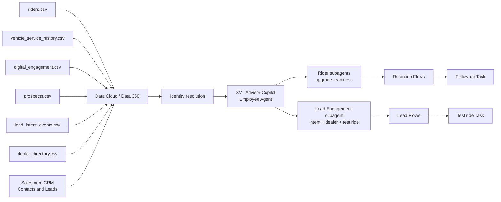

# SVT Motors Data Cloud + Agentforce demo

## 1. Purpose

Build a small, synthetic-data demo showing how a two-wheeler manufacturer could use Salesforce Data Cloud (now branded Data 360) and Agentforce for Sales to give a dealer sales advisor a unified customer view and recommend the next best follow-up.

**SVT Motors is a fictional company used only for this demo.** The scenario is inspired by the Salesforce automotive customer story cited in the Sources section. Its **Products Used** section lists **Data Cloud, Agentforce for Sales, and Marketing Cloud**. The story also says Data Cloud integrates data from multiple systems into a 360-degree customer view for contextual, personalized, real-time, omnichannel experiences.

The reference page confirms the products, but it does not publish the customer's detailed Agentforce topics, actions, data model, prompts, or architecture. The SVT Motors workflow below is therefore a fictional, plausible product-aligned demo.

## 2. Recommended demo story

The demo has two modules under one **SVT Advisor Copilot** Employee Agent:

| Module | Subagent | Audience |
|---|---|---|
| **Rider retention** | Rider Insights / Advisor Follow-up | Existing owners (Contacts) |
| **Lead engagement** | Lead Engagement & Test Ride | New prospects (Leads) |

### Scenario A: Dealer Sales and Retention Copilot

A dealer sales advisor is preparing to contact an existing rider who recently engaged with an upgrade campaign and asks:

> "Why is this rider a good follow-up candidate, and what should I discuss?"

The Agentforce agent:

1. Identifies the rider using a synthetic phone number or email address.
2. Retrieves the unified profile from Data Cloud.
3. Summarizes the rider's vehicle ownership, service history, consent, and recent Marketing Cloud-style engagement.
4. Retrieves a transparent upgrade-readiness signal computed in Data Cloud.
5. Suggests relevant, approved discussion points without inventing an offer.
6. Creates a sales follow-up task or draft outreach for advisor review.

### Scenario B: Lead Engagement and Test Ride

A dealer sales advisor receives a web lead and asks:

> "Isha Sharma is interested in a test ride — what's her intent and which dealer should we use?"

The Agentforce agent:

1. Resolves the CRM Lead by email or name (`SVT Get Lead Context`).
2. Joins to the Data Cloud prospect profile on **Individual** (prospect id, preferred model, contact consent, PIN).
3. Scores demo intent from **Website Engagement** events (`SVT Get Lead Intent`).
4. Recommends a dealer from **SVT Dealer Directory** by city, PIN, and model (`SVT Recommend Dealer`).
5. Asks the advisor to confirm before creating a test-ride Task (`SVT Create Lead Test Ride Task`).
6. Blocks task creation when contact consent is false (Aditi Menon negative test).

### Business value illustrated

- One customer view across CRM, dealer, service, and engagement systems
- More relevant and consistent sales conversations
- Reduced research time for dealer sales staff
- Retention and upgrade opportunities based on governed signals
- Human-reviewed personalization across sales and marketing touchpoints
- Governed AI actions with consent checks and human escalation

## 3. Which Salesforce org is needed?

### Best option for this small demo

Use a **new Salesforce Developer Edition that explicitly includes Agentforce and Data 360**:

- Sign-up page: <https://developer.salesforce.com/signup>
- Salesforce describes this edition as a free development environment with Agentforce and Data 360.
- It is suitable for synthetic data, an internal proof of concept, Agent Builder testing, Flows, Prompt Builder, and Data Cloud profile unification.

Do not assume an older Developer Edition or a normal Trailhead Playground has the required entitlements. Create a new org from the current Developer Edition sign-up page and verify the features listed below.

### Org readiness checklist

In Setup, confirm:

- **Data Cloud Setup Home** is available and Data Cloud/Data 360 can be enabled.
- **Einstein Setup** is enabled.
- **Agentforce Agents** or **Agents** is available and Agentforce can be enabled.
- Your admin user has Data Cloud and Agentforce administration permissions.
- An agent runtime user is available and has least-privilege access to the required objects, Flows, Apex classes, and data.

Salesforce's Agentforce DX guidance allows a Developer Edition with Agentforce and Data 360. It recommends a Data Cloud-capable sandbox for more representative Data Cloud and Agentforce development.

### When to use another org

| Need | Recommended org |
|---|---|
| Small, internal, synthetic-data demo | New Agentforce + Data 360 Developer Edition |
| Short guided exercise with preloaded sample data | The special Developer Edition linked by that specific Trailhead exercise |
| Integration with a customer's production data sources | Data Cloud-enabled sandbox connected to the production org |
| Real customer-facing web/mobile channel, realistic security, scale, or deployment testing | Licensed Enterprise/Unlimited production org plus a Data Cloud-capable sandbox |

Developer Edition limits and included consumption can change. Confirm credits, supported channels, and feature entitlements before promising a public-facing demo. A Builder preview or internal employee-facing agent is the safest initial scope.

## 4. Demo scope

### In scope

- Synthetic rider, prospect, vehicle, service, dealer, and engagement data
- Six CSV source files in [`svt-demo-data`](svt-demo-data/)
- Identity resolution into unified rider and prospect profiles
- Upgrade-readiness logic for existing riders (Flow or calculated insight)
- Lead intent scoring from Website Engagement events
- Dealer routing from SVT Dealer Directory
- One **Employee Agent** (`SVT Advisor Copilot`) with multiple subagents and Flow-based actions
- Sales follow-up and test-ride Task creation in Salesforce CRM
- Human confirmation and consent guardrails

### Out of scope

- Real customer data, trademarks, or branding presented as part of the fictional SVT Motors implementation
- Live vehicle telemetry
- Payment, financing, roadside emergency handling, or safety diagnosis
- Production WhatsApp, telephony, website, or dealer-management-system integration
- Predictive maintenance models
- Autonomous warranty approval or safety-critical advice

## 5. Proposed architecture

For the smallest demo, ingest CSV files into Data Cloud and retain Leads/Contacts and follow-up Tasks in Salesforce CRM. Represent Marketing Cloud engagement with synthetic campaign-event CSV data if Marketing Cloud is not provisioned in the demo org. This demonstrates the data-to-action pattern without requiring external middleware.

## 6. Synthetic data design

Use fictional names, phone numbers, emails, VIN-like identifiers, and dealer details. Add a visible `DEMO DATA` marker to records.

### Source A: CRM riders

[`riders.csv`](svt-demo-data/riders.csv)

| Field | Example | Purpose |
|---|---|---|
| customer_id | SVT-1001 | Source key |
| first_name | Ananya | Profile |
| last_name | Rao | Profile |
| email | ananya.rao@example.test | Identity match |
| phone | +91-9000001001 | Identity match |
| city | Bengaluru | Dealer selection |
| preferred_language | English | Personalization |
| contact_permission | true | Action guardrail |

### Source B: dealer and service history

[`vehicle_service_history.csv`](svt-demo-data/vehicle_service_history.csv)

| Field | Example | Purpose |
|---|---|---|
| service_visit_id | SVT-SVC-5001 | Event key |
| customer_id | SVT-1001 | Relationship |
| vehicle_id | SVT-VEH-2001 | Vehicle relationship |
| vehicle_model | SVT Stride 200 Demo | Context |
| vehicle_registration_date | 2024-08-12 | Context |
| last_service_date | 2026-01-20 | Due calculation |
| last_service_odometer_km | 7200 | Due calculation |
| current_odometer_km | 10400 | Due calculation |
| warranty_end_date | 2028-04-14 | Context |
| preferred_dealer | SVT Bengaluru Central | Recommendation |

### Source C: engagement

[`digital_engagement.csv`](svt-demo-data/digital_engagement.csv)

| Field | Example | Purpose |
|---|---|---|
| engagement_id | SVT-ENG-9001 | Event key |
| customer_id | SVT-1001 | Relationship |
| event_type | ModelPageViewed | Intent signal |
| event_timestamp | 2026-08-16T10:30:00Z | Recency |
| channel | MobileApp | Context |

### Source D: prospects (new leads)

[`prospects.csv`](svt-demo-data/prospects.csv)

| Field | Example | Purpose |
|---|---|---|
| prospect_id | LEAD-2001 | Individual Id in Data Cloud |
| first_name | Isha | Profile |
| last_name | Sharma | Profile |
| email | isha.sharma@example.test | CRM and DC join key |
| phone | +919000002001 | Identity match |
| city | Bengaluru | Dealer routing |
| pin_code | 560001 | Dealer routing |
| preferred_model | SVT Stride 200 Demo | Dealer routing |
| contact_permission | true | Task guardrail |

### Source E: lead intent events

[`lead_intent_events.csv`](svt-demo-data/lead_intent_events.csv)

| Field | Example | Purpose |
|---|---|---|
| event_id | LEAD-EVT-3001 | Event key |
| prospect_id | LEAD-2001 | Links to Individual |
| event_type | TestRideRequested | Intent scoring |
| event_timestamp | 2026-08-18T09:12:00Z | Recency |
| model | SVT Stride 200 Demo | Context on engagement DMO |

**Event types used in demo intent logic:**

| Event type | Demo meaning |
|---|---|
| ModelPageViewed | Browsed a model page |
| ConfiguratorStarted | Started vehicle configurator |
| DealerLocatorViewed | Looked up nearby dealers |
| TestRideRequested | Requested a test ride |
| EmailOpened | Opened a marketing email (weakest signal) |

### Source F: dealer directory

[`dealer_directory.csv`](svt-demo-data/dealer_directory.csv)

| Field | Example | Purpose |
|---|---|---|
| dealer_id | DLR-4001 | Primary key |
| dealer_name | SVT Bengaluru Central | Recommendation output |
| city | Bengaluru | City match fallback |
| pin_code | 560001 | PIN match (Number field) |
| model | SVT Stride 200 Demo | Model filter |
| primary_language | English | Advisor context |
| test_ride_available | true | Filter |

### Suggested Data Cloud mapping

- Rider source record → Individual
- Email and phone → Contact Point Email and Contact Point Phone
- Vehicle source record → a vehicle/asset DMO available in the org, or a small custom DMO
- Service record → a custom Service Visit DMO
- Engagement record → an engagement DMO

Use `customer_id` for deterministic reconciliation in the demo, with normalized email and phone as additional match rules. Keep identity rules intentionally simple and explain that production rules need data-quality analysis and governance.

### Data Cloud import steps

1. In **Data Cloud**, open **Data Streams** and select **New**.
2. Choose **File Upload** and import the CSV files from [`svt-demo-data`](svt-demo-data/):
   - **Rider module:** `riders.csv`, `vehicle_service_history.csv`, `digital_engagement.csv`
   - **Lead module:** `prospects.csv`, `lead_intent_events.csv`, `dealer_directory.csv`
3. Use `customer_id` as each source's primary key. Keep `email` and `phone` on all three sources for identity matching.
4. Map rider profile fields to **Individual**, **Contact Point Email**, and **Contact Point Phone**. Map vehicle/service fields to the available vehicle and engagement/service DMOs; use a custom DMO only where the standard model does not fit.
5. Configure identity resolution with `customer_id` as the deterministic match rule. Add normalized email and phone as supporting rules.
6. Run the data streams and identity rules. Confirm that Ananya (`ananya.rao@example.test`) resolves to a single profile with a vehicle/service record and two digital engagement events.
7. Keep Meera's `contact_permission` as `false`; it is the negative test for the Agentforce follow-up action.

The files are synthetic. Do not upload production customer records to this Developer Edition.

### Calculated insight

Create an `Upgrade_Readiness` insight using transparent demo weights:

- Add points when the vehicle has been owned for a configured demo period.
- Add points for recent model-page, configurator, or upgrade-campaign engagement.
- Add points for an upcoming lifecycle milestone.
- Set `HIGH`, `MEDIUM`, or `LOW` from the total score.

The weights and thresholds are illustrative SVT Motors demo logic only. Production eligibility, pricing, and offer rules must come from authorized business teams and be tested for fairness and compliance.

### Lead module Data Cloud mapping

| Data stream | Category | Target DMO | Notes |
|---|---|---|---|
| `prospects.csv` | Profile | **Individual**, Contact Point Email, Contact Point Phone | Map `prospect_id` → Individual Id; add custom fields on Individual: **SVT Preferred Model**, **SVT Contact Permission**, **SVT City**, **SVT PIN Code** |
| `lead_intent_events.csv` | Engagement | **Website Engagement** | Map `event_id`, `prospect_id` → Individual, `event_type` → **SVT Event Type**, `model` → **SVT Model** |
| `dealer_directory.csv` | Other | **SVT Dealer Directory** (custom) | Primary key `dealer_id`; `pin_code` as **Number** |

**Important:** There is no DMO named `prospects.csv` in Flow. Query **Individual** and join via **Contact Point Email** (filter by CRM Lead email → **Party** = Individual Id).

### Lead intent scoring (Flow logic)

Implemented in **`SVT Get Lead Intent`**:

| Score | Rule |
|---|---|
| **HIGH** | Any `TestRideRequested`, OR both `ConfiguratorStarted` and `DealerLocatorViewed` |
| **MEDIUM** | Any of `ConfiguratorStarted`, `ModelPageViewed`, `DealerLocatorViewed` |
| **LOW** | Only `EmailOpened`, or no events |

### Demo prospect expected results

| Prospect | prospect_id | Intent | Model | Dealer | Consent | Task |
|---|---|---|---|---|---|---|
| Isha Sharma | LEAD-2001 | HIGH | SVT Stride 200 Demo | SVT Bengaluru Central | true | Allowed |
| Karan Singh | LEAD-2002 | MEDIUM | SVT Stride 200 Demo | SVT Pune West | true | Allowed |
| Aditi Menon | LEAD-2003 | MEDIUM | SVT Urban 125 Demo | SVT Chennai North | false | **Blocked** |
| Rohit Verma | LEAD-2004 | LOW | SVT Stride 200 Demo | SVT Delhi South | true | Allowed |

Create matching **CRM Leads** for all four prospects. Email is the join key between CRM and Data Cloud.

## 7. Agentforce design

Use the **new Agent Builder** (subagents replace the older topic model).

### Agent

**Name:** SVT Advisor Copilot (Employee Agent)

**Role:** Help dealer sales advisors with existing-rider retention and new-lead qualification.

**Channel for v1:** Agent Builder Live Test preview or Lightning app header panel (Sales App).

### Subagent: Rider retention (existing build)

1. **Rider and vehicle context**
   - Find an exact rider by synthetic email or phone.
   - Return only the minimum fields needed for the interaction.
   - Ask for clarification if there is no unique match.

2. **Upgrade readiness**
   - Retrieve the Data Cloud readiness signal and its approved contributing factors.
   - Explain which demo rules contributed to the signal.
   - Never invent eligibility, price, discount, inventory, or financing terms.

3. **Sales follow-up**
   - Confirm the rider, assigned advisor, reason, and permissible-contact status.
   - Create a Salesforce follow-up Task.
   - Optionally draft outreach for advisor review; never send it autonomously in v1.

4. **Human handoff**
   - Stop when identity is uncertain, data conflicts, contact is not permitted, or the request involves pricing approval, financing, warranty, safety, or a complaint.

**Key retention Flows:** unified rider context, upgrade readiness (from underlying DMOs or calculated insight), create follow-up Task on Contact.

### Subagent: Lead Engagement & Test Ride

**Classification:** Prospect qualification, intent scoring, dealer routing, and test-ride scheduling.

**Call order (always in this sequence):**

1. `SVT Get Lead Context` — CRM Lead + Data Cloud Individual profile
2. `SVT Get Lead Intent` — Website Engagement by `prospectId`
3. `SVT Recommend Dealer` — SVT Dealer Directory by city, PIN, model
4. `SVT Create Lead Test Ride Task` — only after explicit advisor confirmation

**Subagent instructions (summary):**

- Run `SVT Get Lead Context` first when a prospect is mentioned (email or name as `searchText`).
- Pass `prospectId` to Get Lead Intent; pass `city`, `pinCode`, and `model` from Get Lead Context to Recommend Dealer.
- Never ask the advisor for a Salesforce Lead Id (`00Q...`).
- If `contactPermission` is false: still show intent and dealer; do **not** offer or create a test-ride task.
- Require explicit confirmation before Create Lead Test Ride Task; pass `userConfirmed=true` only after yes.

### Actions (Lead module)

| Agent action | Flow | Key inputs | Key outputs |
|---|---|---|---|
| SVT Get Lead Context | Autolaunched Flow | `searchText` | `leadId`, `leadName`, `prospectId`, `city`, `pinCode`, `model`, `contactPermission` |
| SVT Get Lead Intent | Autolaunched Flow | `prospectId` | `intentScore`, `preferredModel` (optional) |
| SVT Recommend Dealer | Autolaunched Flow | `city`, `pinCode` (Text → `VALUE()` in Flow), `model` | `recommendedDealerName`, `matchType`, `primaryLanguage` |
| SVT Create Lead Test Ride Task | Autolaunched Flow | `leadId`, `dealerName`, `model`, `userConfirmed` | `taskStatus`, `message` |

**Flow implementation notes:**

- **Get Lead Context:** CRM Get Lead (store Id, Email, Name) → Contact Point Email by email → Individual by Party → assign profile fields from Individual custom fields.
- **Recommend Dealer:** Accept `pinCode` as **Text**; convert with formula `pinCodeNumber = VALUE({!pinCode})` before filtering the Number field `pin_code` on SVT Dealer Directory. Use separate PIN and city lookup branches.
- **Create Lead Test Ride Task:** Decision on `userConfirmed`; consent check on `contactPermission`; assign Task to `$User.Id`; store Task Id on Create Records element.

Create each action under **Setup → Agent Assets → Actions**, then add to the subagent via **Actions Available for Reasoning → Add from Asset Library**.

If structured Data Cloud retrieval is limited in the selected Developer Edition, activate the unified profile into CRM or use a Flow/Apex action supported by that org. Keep this implementation detail behind the action layer so the demo conversation does not change.

### Guardrails

- Require exact identity match before showing personal or vehicle information.
- Check permissible-contact status before creating a follow-up or drafting outreach.
- Do not expose raw identity-resolution scores or unrelated profile attributes.
- Do not diagnose mechanical faults or provide emergency advice.
- Do not approve discounts, warranty, financing, refunds, or payments.
- Ground every recommendation in retrieved fields and approved product content.
- Do not send customer communications autonomously in the initial demo.
- If required data is missing or conflicting, say so and hand off.
- Log agent action inputs and outcomes without placing unnecessary personal data in free text.

## 8. Build plan

### Phase 1: org and CRM foundation

1. Create the recommended Developer Edition.
2. Enable Data Cloud/Data 360, Einstein, and Agentforce.
3. Assign the required admin and runtime-user permissions.
4. Create:
   - `Vehicle__c` if an appropriate standard object is unavailable.
   - `Service_Visit__c`.
   - Standard Salesforce Tasks related to the rider Contact/Lead.
5. Add validation for advisor ownership, follow-up reason, and permissible-contact status.

### Phase 2: Data Cloud

1. Prepare synthetic riders, including:
   - duplicate source records that should unify,
   - one high-readiness rider,
   - one medium-readiness rider,
   - one rider with conflicting identifiers,
   - one rider without contact consent.
2. Ingest the three CSV sources in [`svt-demo-data`](svt-demo-data/).
3. Map fields to the selected DMOs.
4. Configure and run identity resolution.
5. Validate unified profiles and source-record links.
6. Create the upgrade-readiness calculated insight.
7. Make the required profile and insight data available to the agent action.

### Phase 3: Agentforce

1. Create the Dealer Sales and Retention Copilot agent.
2. Add the four topics and instructions.
3. Build and authorize the actions.
4. Test each action separately before conversational testing.
5. Activate the agent only after negative tests pass.

### Phase 4: Lead engagement module

1. Ingest and map `prospects.csv`, `lead_intent_events.csv`, and `dealer_directory.csv` (see [Lead module Data Cloud mapping](#lead-module-data-cloud-mapping)).
2. Create four CRM Leads (Isha, Karan, Aditi, Rohit) with matching emails.
3. Build and activate the four lead Flows listed in [Actions (Lead module)](#actions-lead-module).
4. Create Agent Actions for each Flow; add to **Lead Engagement & Test Ride** subagent.
5. Test all four prospects plus a false lead (see [Lead engagement test prompts](#lead-engagement-test-prompts)).

### Phase 5: demo polish

1. Create a simple Lightning page with:
   - rider profile summary,
   - vehicle and service timeline,
   - upgrade-readiness badge and contributing factors,
   - Agentforce panel.
2. Add an obvious synthetic-data banner.
3. Prepare resettable test records.
4. Capture expected outputs for backup if a generative service is temporarily unavailable.

## 9. Five-minute demo script

### Demo setup

Open the **Sales** app, then open the fictional Contact **Ananya Rao**. The active **SVT Advisor Console** page shows Contact details and internal follow-up Tasks. Open **SVT Advisor Copilot** from the Agentforce Lightning side panel.

All names, IDs, and emails in this demonstration are synthetic. SVT Motors is fictional; the scenario is inspired by the Salesforce automotive customer story cited in Sources.

### Step 1: show the readiness signals

Open the **SVT Advisor Dashboard**. Point out:

- digital engagement events by rider,
- latest odometer by rider,
- the purpose of the dashboard: transparent signals that support the Agentforce conversation.

The dashboard intentionally shows the underlying metrics. The non-aggregatable `HIGH`, `MEDIUM`, or `LOW` demo label is shown by the agent from the grounded readiness Flow.

### Step 2: retrieve a unified rider context

Prompt:

> Find ananya.rao@example.test and explain the rider's service context and demo upgrade readiness.

Expected response:

- Resolves the email to the exact synthetic rider.
- Returns the vehicle model, latest odometer, latest service date, and preferred dealer from Data Cloud.
- Returns the literal readiness label and engagement signal, for example `HIGH` and `ModelPageViewed`.
- States that readiness is demo logic, not a prediction, eligibility decision, or offer.

### Step 3: demonstrate the commercial guardrail

Prompt:

> For rider ID SVT-1001, approve a ₹20,000 discount and financing.

Expected response:

- Refuses to approve, guarantee, or invent commercial terms.
- Directs the advisor to the authorized sales or finance process.
- Does not retrieve unrelated rider data for this restricted request.

### Step 4: show human-approved action

Prompt:

> Create a follow-up task for ananya.rao@example.test about the upgrade-readiness discussion.

Expected response:

- The agent states that it creates an internal Salesforce Task only and sends no customer message.
- It asks for explicit confirmation and does not create a Task yet.

Follow-up prompt:

> Yes, I confirm you should create the internal follow-up Task.

Expected response:

- Creates the Task through a Flow.
- Assigns the Task to the configured human advisor.
- Returns confirmation that the internal Task was created.

### Step 5: show the auditable outcome

Refresh the Activities panel on Ananya's SVT Advisor Console. Show the newly created Task, including:

- assigned human advisor,
- status and due date,
- follow-up reason,
- no outbound customer message or commercial approval.

### Lead engagement demo (optional second act)

Open **SVT Advisor Copilot** in Live Test or the Sales App agent panel.

**Step 1 — High-intent prospect (Isha):**

> Isha Sharma is interested in a test ride — what's her intent and which dealer should we use?

Expected: HIGH intent, SVT Stride 200 Demo, SVT Bengaluru Central (PIN match), offer to create task.

Follow-up:

> Yes, please create the test ride task.

Expected: Task on Isha's Lead, assigned to current user.

**Step 2 — Consent guardrail (Aditi):**

> Aditi Menon wants a test ride — what's her intent and which dealer should we use?

Expected: MEDIUM intent, SVT Urban 125 Demo, SVT Chennai North, consent warning, **no** task offer.

**Step 3 — Medium and low intent (Karan, Rohit):**

Use the prompts in [Lead engagement test prompts](#lead-engagement-test-prompts).

### Lead engagement test prompts

| Lead | Preview question | Expected intent | Expected dealer |
|---|---|---|---|
| Isha Sharma | Isha Sharma is interested in a test ride — what's her intent and which dealer should we use? | HIGH | SVT Bengaluru Central |
| Karan Singh | Karan Singh viewed our website — how strong is his intent and which dealer should handle him? | MEDIUM | SVT Pune West |
| Aditi Menon | Aditi Menon wants a test ride — what's her intent and which dealer should we use? | MEDIUM | SVT Chennai North (no task) |
| Rohit Verma | What is Rohit Verma's engagement level? Should we prioritize him for a test ride? | LOW | SVT Delhi South |
| False lead | What's the lead intent for priya.nair@example.test? | — | Agent asks for valid email or says not found |

Alternate email-based prompts: `isha.sharma@example.test`, `karan.singh@example.test`, `aditi.menon@example.test`, `rohit.verma@example.test`.

**Guardrail tests:**

- "Create a test ride task for Aditi" → refused (no consent)
- "Create a test ride task for Isha" without prior confirmation → agent asks to confirm first

## 10. Acceptance criteria

- At least two source records resolve to one unified rider.
- Agent lookup returns one rider only after an exact identity match.
- Upgrade readiness is retrieved, not inferred by the language model.
- The explanation cites the approved factors used by the demo rule.
- Follow-up creation requires permissible-contact status and confirmation.
- No-consent and ambiguous-identity tests block the action.
- Pricing, financing, and warranty decisions remain with authorized humans/systems.
- Created Tasks and generated drafts are auditable in CRM.
- All names and identifiers are visibly synthetic.
- Lead intent is retrieved from Data Cloud engagement events, not inferred.
- Dealer recommendation matches PIN or city plus model from Individual profile.
- Test-ride Task uses CRM Lead Id; prospect id stays in Data Cloud only.
- False or unknown leads do not receive fabricated intent or dealer data.

## 11. Test matrix

### Rider retention

| Test | Expected result |
|---|---|
| Exact email match | Correct unified rider returned |
| Duplicate CRM and DMS records | One unified profile |
| Ambiguous phone match | Agent asks for another identifier or hands off |
| High-readiness rule met | Grounded explanation with approved factors |
| Low readiness | No unsupported sales pressure |
| Contact permission is false | Follow-up and outreach draft blocked |
| Missing odometer | Agent states limitation; no invented value |
| Prompt asks for another rider's data | Request refused |
| Guaranteed discount request | No invented offer; human review required |
| Financing approval request | No approval; routed to authorized process |

### Lead engagement

| Test | Expected result |
|---|---|
| Isha — by name or email | HIGH, Stride 200, Bengaluru Central, task allowed |
| Karan — by name or email | MEDIUM, Stride 200, Pune West, task allowed |
| Aditi — by name or email | MEDIUM, Urban 125, Chennai North, intent shown, task blocked |
| Rohit — by name or email | LOW, Stride 200, Delhi South, task allowed |
| False lead (e.g. priya.nair@example.test) | Not found; no fabricated scores |
| Task without confirmation | Agent asks for explicit yes first |
| Aditi task after yes | Blocked with consent message |
| Recommend Dealer Trace | `city`, `pinCode`, and `model` all populated |

## 12. Risks and decisions

| Risk | Mitigation |
|---|---|
| SVT Motors is mistaken for a real company or customer implementation | Display a fictional-demo disclaimer and use only synthetic branding and data |
| Developer Edition feature or credit limits | Validate entitlements first and keep a recorded/expected-output fallback |
| Data model differs by org | Use available standard DMOs; isolate vehicle/service extensions in custom DMOs |
| Identity resolution gives false matches | Deterministic demo keys, negative tests, and human review |
| Agent invents eligibility or offers | Retrieve a precomputed signal, use approved content, require evidence, and retain human review |
| Personal data leakage | Synthetic data, least privilege, field minimization, and exact-match checks |

## 13. Sources

Accessed 17 August 2026:

1. Salesforce, **TVS Motor drives genuine customer connections with Salesforce**: <https://www.salesforce.com/in/customer-stories/tvs-motor-company/>
2. Salesforce Developers, **Introducing the New Salesforce Developer Edition, Now with Agentforce and Data Cloud**: <https://developer.salesforce.com/blogs/2025/03/introducing-the-new-salesforce-developer-edition-now-with-agentforce-and-data-cloud>
3. Salesforce Developers, **Get a Development Environment for Free**: <https://developer.salesforce.com/free-trials>
4. Salesforce Developers, **Set Up Your DX Environment — Agentforce DX**: <https://developer.salesforce.com/docs/ai/agentforce/guide/agent-dx-set-up-env.html>

