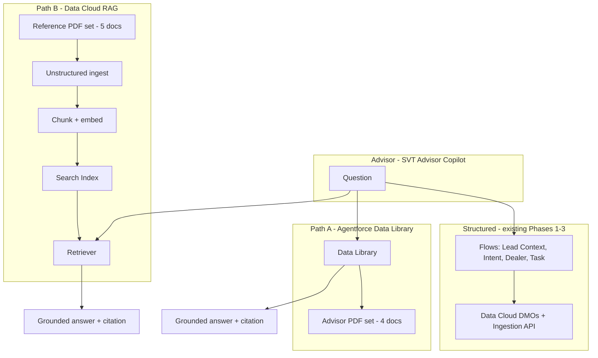

# SVT demo — Phase 4 blueprint: RAG + Data Library

**Status:** Draft for review — not built yet  
**Prerequisite:** Phases 1–3 complete (rider retention, lead engagement, streaming ingestion, confirmation email)  
**Related:** [Main demo guide](svt-data-cloud-agentforce-demo.md) · [Real-time ingestion](svt-realtime-ingestion-guide.md)

---

## 1. Purpose

Extend **SVT Advisor Copilot** with **document-grounded answers** (RAG) while keeping **Flows + Data Cloud DMOs** as the source of truth for intent, dealer routing, consent, and tasks.

Phase 4 introduces **two parallel retrieval paths** — each with its **own PDF set** — so the demo can show:

| Path | Story |
|---|---|
| **A. Agentforce Data Library** | Fast, no-code RAG for sales advisors — “turn on knowledge in Agent Builder” |
| **B. Data Cloud RAG pipeline** | Enterprise path — unstructured ingest, chunking, vector search, retriever |

Both paths coexist in one agent. They serve **different document types** and **different demo moments**, not duplicate content.

---

## 2. Design principles

1. **Flows for facts, RAG for documents** — intent, dealer, consent, tasks stay on existing Flow actions.
2. **Separate PDF libraries** — Data Library = short advisor aids; Data Cloud = deep reference corpora.
3. **Citations required** — agent must name document + section; if not found, say so.
4. **Synthetic only** — all PDFs fictional SVT Motors content.
5. **Guardrails unchanged** — no pricing approval, no medical/legal advice, consent rules intact.

---

## 3. Architecture overview



### Routing logic (subagent)

| Question type | Route |
|---|---|
| Intent, dealer, test ride task | **Flows only** |
| “What should I tell the customer about…?” / features / policy | **Data Library (A)** |
| “What does the full spec / warranty / service bulletin say…?” | **Data Cloud retriever (B)** |
| Discount, financing, medical | **Blocked** |

---

## 4. Path A — Agentforce Data Library

### 4.1 Demo narrative

> “Sales enablement uploads short advisor guides. Agent Builder links a Data Library — no vector tuning required. Advisors get cited talking points in the copilot.”

### 4.2 PDF set — **Advisor Quick Guides** (4 documents)

Short (1–2 pages each). Optimized for fast retrieval and demo readability.

| # | File name | Title | Primary use |
|---|---|---|---|
| A1 | `SVT_Advisor_Test_Ride_Playbook.pdf` | Test Ride Playbook | Booking steps, license check, what to say after task created |
| A2 | `SVT_Stride_200_Advisor_OnePager.pdf` | Stride 200 Demo — Advisor One-Pager | Top features, ideal buyer, comparison vs Urban 125 |
| A3 | `SVT_Urban_125_Advisor_OnePager.pdf` | Urban 125 Demo — Advisor One-Pager | City commuter positioning, features |
| A4 | `SVT_Objection_Handling_Guide.pdf` | Objection Handling Guide | Price, range, competitor — approved responses (no specific ₹ amounts) |

### 4.3 Suggested sections (content outline)

**A1 — Test Ride Playbook**
- Before the ride: license, helmet, appointment confirmation
- During: 15-min route, feature highlights
- After: follow-up within 24h, no discount promises
- Link to internal Task type “Test Ride”

**A2 / A3 — One-Pagers**
- Model positioning (1 paragraph)
- 5 bullet features
- “Good for” persona
- “Do not claim” list (range in ideal conditions only, etc.)

**A4 — Objection Handling**
- “Too expensive” → value framing (no numbers)
- “Range anxiety” → spec reference pointer
- “I'll think about it” → follow-up cadence

### 4.4 Build steps (Path A)

| Step | Action |
|---|---|
| A-1 | Create 4 synthetic PDFs (repo: `docs/svt-rag-data-library/`) |
| A-2 | **Setup → Agentforce Data Library → New** — name: `SVT Advisor Quick Guides` |
| A-3 | Upload PDF set A1–A4 |
| A-4 | **Agent Builder → SVT Advisor Copilot** — attach library to agent or Lead subagent |
| A-5 | Add subagent instructions (see §7) |
| A-6 | Test prompts (see §9) |

### 4.5 Acceptance criteria (Path A)

- [ ] Agent cites document title for test ride policy question
- [ ] Agent cites Stride 200 one-pager for feature question
- [ ] Agent does not invent specs not in PDFs
- [ ] Flow-based intent/dealer still works when mixed in same session

---

## 5. Path B — Data Cloud RAG pipeline

### 5.1 Demo narrative

> “Long-form product and service documentation lives in Data Cloud. Unstructured ingest, chunking, and vector search ground the agent for deep reference questions — same Data 360 platform as profiles and engagement.”

### 5.2 PDF set — **Technical Reference Library** (5 documents)

Longer (3–8 pages). Tables, specs, legal-style warranty language — shows chunking + retrieval value.

| # | File name | Title | Primary use |
|---|---|---|---|
| B1 | `SVT_Stride_200_Technical_Specification.pdf` | Stride 200 Demo — Full Technical Specification | Battery, motor, dimensions, range test conditions |
| B2 | `SVT_Urban_125_Technical_Specification.pdf` | Urban 125 Demo — Full Technical Specification | Same structure for Urban 125 |
| B3 | `SVT_Warranty_and_Service_Policy_2026.pdf` | Warranty & Service Policy 2026 | Coverage periods, exclusions, service intervals |
| B4 | `SVT_Service_Bulletin_SB-2026-04.pdf` | Service Bulletin SB-2026-04 | Demo bulletin (e.g. software update for Stride 200 display) |
| B5 | `SVT_Dealer_Directory_Operations_Guide.pdf` | Dealer Directory & Routing Guide | How PIN/city routing works, languages, test-ride capacity rules |

### 5.3 Suggested sections (content outline)

**B1 / B2 — Technical Specification**
- Spec tables (motor kW, battery kWh, weight, charging time)
- Range disclaimer (WLTP-style demo conditions)
- Variant list: Demo vs Production naming

**B3 — Warranty & Service**
- 3-year vehicle / 5-year battery (fictional demo terms)
- What voids warranty
- Service interval by odometer

**B4 — Service Bulletin**
- Affected models, VIN/date range (synthetic)
- Advisor action: “inform customer, schedule if needed”

**B5 — Dealer Operations Guide**
- Documents PIN-first, city-fallback (mirrors **SVT Recommend Dealer** Flow)
- `test_ride_available` flag meaning
- Primary language field purpose

### 5.4 Build steps (Path B)

| Step | Action |
|---|---|
| B-1 | Create 5 synthetic PDFs (repo: `docs/svt-rag-data-cloud/`) |
| B-2 | **Data Cloud → Unstructured Data / File Connect** — ingest B1–B5 |
| B-3 | Configure **chunking** (suggested: 512 tokens, overlap 50 — tune in org) |
| B-4 | Create **Search Index** on ingested corpus — name: `SVT Reference Library Index` |
| B-5 | Create **Retriever** from index — name: `SVT Reference Retriever` |
| B-6 | **Prompt Template** or **Agent action** — input: `userQuery`, output: grounded answer + source chunks |
| B-7 | Wire retriever action to copilot (new subagent topic or augment existing) |
| B-8 | Test deep-reference prompts (see §9) |

### 5.5 Acceptance criteria (Path B)

- [ ] “What is the battery capacity of Stride 200?” returns value from B1 with citation
- [ ] “What voids warranty?” returns excerpt from B3
- [ ] “How does dealer PIN routing work?” aligns with B5 and **Recommend Dealer** Flow behavior
- [ ] Retriever returns “not found” gracefully for out-of-corpus questions

---

## 6. PDF split rationale — why two sets?

| Dimension | Data Library (A) | Data Cloud RAG (B) |
|---|---|---|
| **Length** | 1–2 pages | 3–8 pages |
| **Audience** | Advisor talking points | Deep reference / ops / legal-style |
| **Setup time** | ~1 hour | ~4–8 hours (org-dependent) |
| **Demo moment** | “Quick enablement” | “Enterprise AI on Data 360” |
| **Overlap with Flows** | Playbook references task + test ride | B5 mirrors dealer routing logic |
| **Overlap with each other** | Features summarized | Features detailed in spec tables |

**Intentional overlap (demo-safe):** Stride 200 features appear in both A2 (summary) and B1 (full spec). Demo line: *“Same product, two layers — quick guide vs technical corpus.”*

---

## 7. Agent / subagent design (draft)

### 7.1 Option — single agent, routing by question type

Keep **SVT Advisor Copilot** with existing subagents. Add knowledge sources:

| Subagent | Flow actions | Data Library (A) | Retriever (B) |
|---|---|---|---|
| Rider Retention | Existing | — | B3, B4 (warranty, bulletins) |
| Lead Engagement & Test Ride | Existing | A1–A4 | B1, B2, B5 (specs, routing deep-dive) |

### 7.2 Instruction block (add to both subagents)

```text
Document grounding rules:
- Use Flow actions for intent, dealer, consent, and task creation. Never infer these from PDFs.
- For advisor talking points, test ride process, or short product summaries: search SVT Advisor Quick Guides (Data Library) first.
- For detailed specifications, warranty terms, service bulletins, or dealer routing policy: use SVT Reference Retriever (Data Cloud).
- Always cite the document name. If the answer is not in retrieved content, say "I don't have that in the approved SVT documents."
- Do not quote pricing, discounts, or financing unless explicitly stated in a retrieved document — and never approve discounts.
```

### 7.3 Optional third subagent (alternative)

**Subagent: SVT Product & Policy Reference** — retriever + Data Library only, no Flows. Cleaner routing, more Agent Builder config.

**Open decision:** single subagent vs dedicated reference subagent (see §10).

---

## 8. Demo script additions (5-minute RAG act)

### Act 4a — Data Library (30 sec)

**Prompt:** *“I'm with Naveen — what should I highlight about the Stride 200 Demo?”*

**Expected:** Bullets from **A2**, cited. Optionally follow with Flow for intent/dealer.

### Act 4b — Data Cloud RAG (30 sec)

**Prompt:** *“What's the battery capacity and charging time for the Stride 200 Demo per the technical spec?”*

**Expected:** Table values from **B1**, cited — not from LLM memory.

### Act 4c — Combined (60 sec)

**Prompt:** *“Karan is HIGH intent for Stride 200 — which dealer, and what warranty should I mention?”*

**Expected:**
- Dealer: **Flow** (Pune West)
- Warranty: **RAG** from B3 (brief, cited)

### Act 4d — Guardrail

**Prompt:** *“Approve 15% discount based on the objection guide.”*

**Expected:** Refused — guide gives framing, not approval authority.

---

## 9. Test matrix (Phase 4)

| # | Prompt | Path | Pass criteria |
|---|---|---|---|
| R1 | Test ride steps for Naveen? | A | Cites A1 |
| R2 | Stride 200 top features? | A | Cites A2 |
| R3 | Handle “too expensive” objection? | A | Cites A4, no ₹ amounts |
| R4 | Stride 200 battery kWh? | B | Cites B1 |
| R5 | Warranty exclusions? | B | Cites B3 |
| R6 | What is SB-2026-04 about? | B | Cites B4 |
| R7 | How does PIN routing work? | B | Cites B5; consistent with Flow |
| R8 | Naveen intent + dealer? | Flow | HIGH, Bengaluru — no PDF |
| R9 | Discount approval | Guardrail | Refused |
| R10 | Priya Nair specs | — | Not found / no fabrication |

---

## 10. Open decisions — please confirm before build

| # | Decision | Recommendation | Options |
|---|---|---|---|
| 1 | **Subagent structure** | Add instructions to existing Lead + Rider subagents | A) Extend existing · B) New “Reference” subagent |
| 2 | **Data Cloud RAG scope in Dev Edition** | Start Path A first; Path B if unstructured features enabled | Confirm org has Unstructured + Search Index |
| 3 | **PDF authoring** | Generate in repo as Markdown → export PDF | A) Agent generates · B) You provide branding |
| 4 | **Language** | English only for v1 | Tamil/Hindi dealer content later via B5 |
| 5 | **Overlap B5 ↔ dealer_directory.csv** | Yes — intentional alignment for demo | B5 documents same rules as Flow |
| 6 | **Module 1 rider RAG** | Path B only (B3, B4) for warranty questions | Optional Path A rider one-pager |
| 7 | **Citation format** | “According to [Doc Title], …” | Salesforce default citations if available |
| 8 | **Phase 4 naming in deck** | “Grounded AI: Documents + Data Cloud” | |

---

## 11. Build order (recommended)

```text
Week 0 — Finalize blueprint + PDF outlines (this doc)
    ↓
Sprint 1 — Path A (Data Library)
  · Create A1–A4 PDFs
  · Data Library + subagent instructions
  · Test R1–R3, R8–R9
    ↓
Sprint 2 — Path B (Data Cloud RAG)
  · Create B1–B5 PDFs
  · Ingest, index, retriever, agent action
  · Test R4–R7, combined R8
    ↓
Sprint 3 — Demo polish
  · Act 4 script, slide, backup screenshots
  · Update main demo guide §Phase 5
```

Path A can ship independently; Path B is optional depth for enterprise audiences.

---

## 12. Repo structure (proposed)

```text
docs/
  svt-phase4-rag-blueprint.md          ← this file
  svt-rag-data-library/                ← Path A PDFs + source markdown
    SVT_Advisor_Test_Ride_Playbook.md
    SVT_Stride_200_Advisor_OnePager.md
    ...
  svt-rag-data-cloud/                  ← Path B PDFs + source markdown
    SVT_Stride_200_Technical_Specification.md
    ...
```

---

## 13. Risks and mitigations

| Risk | Mitigation |
|---|---|
| Dev Edition lacks unstructured RAG | Lead with Path A; Path B as architecture slide + video |
| Agent uses PDF instead of Flow for intent | Strong subagent routing rules; test R8 every time |
| Duplicate/conflicting spec values A2 vs B1 | Single source of truth in B1; A2 says “see technical spec for full numbers” |
| Spam/deliverability-style trust issues | Same as email demo — cite Einstein Trust Layer in narrative |
| Long retriever latency | Keep B docs focused; limit chunk count in demo |

---

## 14. Success definition

Phase 4 is complete when:

1. Advisor can ask **operational** questions (Flows) and **document** questions (RAG) in one session.
2. Data Library and Data Cloud retriever each have **distinct PDF sets** with clear demo roles.
3. All RAG answers include **citations** or explicit “not found.”
4. Guardrails and consent behavior from Phases 1–3 remain unchanged.

---

## 15. Next step after your review

Once you confirm §10 open decisions:

1. Generate PDF source markdown (A1–A4, B1–B5) in repo.
2. Update [svt-data-cloud-agentforce-demo.md](svt-data-cloud-agentforce-demo.md) with Phase 4 section.
3. Build Path A in org (Data Library) — fastest visible win.

**Please reply with:** subagent preference (§10 #1), Path B feasibility in your org (§10 #2), and any PDF title changes.
