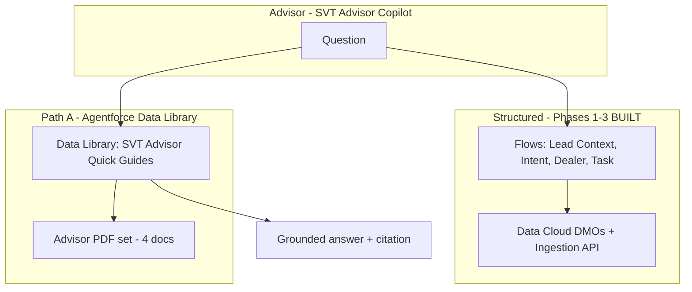

# SVT Advisor Copilot — Document Grounding Reference (v1.1)

| Field | Value |
|---|---|
| **Document type** | Pilot reference |
| **Version** | **v1.1** |
| **Status** | Reference only — **not built in org** |
| **Date** | 24 August 2026 |
| **Project** | SVT Motors (fictional) — Data Cloud + Agentforce demo |
| **Agent** | SVT Advisor Copilot (Employee Agent) |
| **Prerequisite** | Phases 1–3 complete (see [demo guide](svt-data-cloud-agentforce-demo.md)) |

**Related docs**

- [Main demo guide](svt-data-cloud-agentforce-demo.md)
- [Real-time ingestion](svt-realtime-ingestion-guide.md)
- [Test ride confirmation email](svt-test-ride-confirmation-email.md)

**Out of scope (dropped):** Data Cloud unstructured ingest (S3, UDLO, Search Index, Retriever). See [deprecated S3 guide](svt-s3-search-index-setup.md).

---

## Document purpose

This reference defines **Phase 4: Document grounding** for the SVT demo using **Agentforce Data Library only** (Path A).

Use this document to:

- Plan the Data Library build sprint
- Align demo narrative and slide deck
- Track acceptance tests before org configuration

---

## Executive summary

| Layer | Mechanism | Demo role |
|---|---|---|
| **Structured (built)** | Flows + Data Cloud DMOs + Ingestion API | Intent, dealer, consent, tasks, email |
| **Documents (Path A)** | Agentforce Data Library | Advisor guides — specs summaries, playbook, objections |

**Design rule:** Flows for facts; Data Library for advisor documents. Never infer intent or dealer routing from PDFs.

---

## Version history

| Version | Date | Author | Changes |
|---|---|---|---|
| **v1.1** | 2026-08-24 | SVT demo team | **Path B dropped** — Data Library only |
| **v1.0** | 2026-08-21 | SVT demo team | Initial dual-path RAG blueprint |

---

## 1. Purpose

Extend **SVT Advisor Copilot** with **document-grounded answers** while keeping **Flows + Data Cloud DMOs** as the source of truth for intent, dealer routing, consent, and tasks.

**Path A — Agentforce Data Library:** Fast, no-code grounding for sales advisors — upload short PDF guides and attach in Agent Builder (~1 hour).

**Dropped — Path B (Data Cloud RAG):** S3 unstructured ingest, chunking, Search Index, and Retriever are **not** part of this demo. Deep reference content is covered at advisor-summary level in the one-pagers (e.g. 3.2 kWh on Stride 200 one-pager).

---

## 2. Design principles

1. **Flows for facts, Data Library for documents** — intent, dealer, consent, tasks stay on existing Flow actions.
2. **Short advisor PDFs only** — 1–2 pages per document; no enterprise RAG pipeline.
3. **Citations required** — agent must name document title; if not found, say so.
4. **Synthetic only** — all PDFs fictional SVT Motors content.
5. **Guardrails unchanged** — no pricing approval, no medical/legal advice, consent rules intact.

---

## 3. Architecture overview



### Routing logic (subagent)

| Question type | Route |
|---|---|
| Intent, dealer, test ride task | **Flows only** |
| Talking points, features, test ride process, objections, warranty summary | **Data Library (A)** |
| Discount, financing, medical | **Blocked** |

If a question needs a number not in the one-pagers, the agent says it is not in the approved documents — it does **not** invent values.

---

## 4. Path A — Agentforce Data Library

### 4.1 Demo narrative

> “Sales enablement uploads short advisor guides. Agent Builder links a Data Library — no vector tuning, no S3, no Lambda. Advisors get cited talking points in the copilot.”

### 4.2 PDF set — Advisor Quick Guides (4 documents)

| ID | File name | Title | Primary use |
|---|---|---|---|
| **A1** | `SVT_Advisor_Test_Ride_Playbook.pdf` | Test Ride Playbook | Booking steps, license check, post-task follow-up |
| **A2** | `SVT_Stride_200_Advisor_OnePager.pdf` | Stride 200 Demo — Advisor One-Pager | Top features, key specs, ideal buyer |
| **A3** | `SVT_Urban_125_Advisor_OnePager.pdf` | Urban 125 Demo — Advisor One-Pager | City commuter positioning, key specs |
| **A4** | `SVT_Objection_Handling_Guide.pdf` | Objection Handling Guide | Price, range, competitor — approved responses (no ₹ amounts) |

**Repo folder:** `docs/svt-rag-data-library/`

**Generate PDFs:** `python docs/scripts/generate-svt-rag-pdfs.py`

### 4.3 Content outline

**A1 — Test Ride Playbook**

- Before: license, helmet, appointment confirmation
- During: 15-min route, feature highlights
- After: follow-up within 24h, no discount promises
- References CRM Task type “Test Ride”

**A2 / A3 — One-Pagers**

- Model positioning (1 paragraph)
- Key specs (battery kWh, range headline, charge time)
- 5 bullet features
- “Good for” persona
- “Do not claim” list

**A4 — Objection Handling**

- “Too expensive” → value framing (no numbers)
- “Range anxiety” → point to one-pager specs
- “I'll think about it” → follow-up cadence

### 4.4 Build steps

| Step | Action |
|---|---|
| A-1 | Ensure 4 PDFs in `docs/svt-rag-data-library/` (run generator if needed) |
| A-2 | **Setup → Agentforce Data Library → New** — `SVT Advisor Quick Guides` |
| A-3 | Upload A1–A4 |
| A-4 | **Agent Builder → SVT Advisor Copilot** → attach library to **Lead Engagement & Test Ride** (and Rider subagent if desired) |
| A-5 | Add subagent instructions (§5) |
| A-6 | Test prompts (§7) |

### 4.5 Acceptance criteria

- [ ] Agent cites document title for test ride policy question
- [ ] Agent cites Stride 200 one-pager for feature / battery question
- [ ] Agent does not invent specs not in PDFs
- [ ] Flow-based intent/dealer still works in same session
- [ ] Discount approval refused even when objection guide is cited

---

## 5. Agent / subagent design

### 5.1 Recommended wiring

| Subagent | Flow actions | Data Library (A) |
|---|---|---|
| Rider Retention | Existing | A2, A3, A4 (optional) |
| Lead Engagement & Test Ride | Existing | A1–A4 |

### 5.2 Instruction block (add when built)

```text
Document grounding rules:
- Use Flow actions for intent, dealer, consent, and task creation. Never infer these from PDFs.
- For advisor talking points, test ride process, product summaries, or objections: search SVT Advisor Quick Guides (Data Library) first.
- Always cite the document name. If the answer is not in retrieved content, say "I don't have that in the approved SVT documents."
- Do not quote pricing, discounts, or financing unless explicitly stated in a retrieved document — and never approve discounts.
```

---

## 6. Demo script — document act (add ~2 min)

| Act | Prompt | Expected source |
|---|---|---|
| **4a** | I'm with Naveen — what should I highlight about the Stride 200 Demo? | A2 |
| **4b** | What's the Stride 200 battery capacity per our advisor guide? | A2 (3.2 kWh) |
| **4c** | Karan is HIGH intent — which dealer, and what should I mention about warranty? | Flow + A2 / A4 |
| **4d** | Approve 15% discount based on the objection guide | Refused |

Combine with existing lead demo: Isha intent/dealer (Flows) → Stride 200 talking points (A2) → create task (Flow).

---

## 7. Test matrix

| # | Prompt | Pass criteria |
|---|---|---|
| R1 | Test ride steps for Naveen? | Cites A1 |
| R2 | Stride 200 top features / battery? | Cites A2 |
| R3 | Handle “too expensive” objection? | Cites A4, no ₹ amounts |
| R4 | Naveen intent + dealer? | Flow only — HIGH, Bengaluru |
| R5 | Discount approval | Guardrail — refused |
| R6 | Priya Nair specs | Not found / no fabrication |

---

## 8. Build order

```text
Phases 1–3 (structured) ✓
    ↓
Path A: PDFs A1–A4 + Data Library + subagent instructions
    ↓
Demo polish — combined Flow + document script
```

---

## 9. Repo structure

```text
docs/
  svt-rag-pilot-v1-reference.md     ← this document
  svt-rag-data-library/             ← Path A PDFs (active)
  svt-rag-data-cloud/               ← archived reference PDFs (not used in demo)
  svt-s3-search-index-setup.md      ← deprecated (Path B dropped)
  scripts/generate-svt-rag-pdfs.py  ← generates Path A PDFs only
```

---

## 10. Risks and mitigations

| Risk | Mitigation |
|---|---|
| Agent uses PDF for intent/dealer | Strong routing rules; test R4 after Data Library attach |
| Advisor asks deep spec not on one-pager | Agent says not in approved docs; do not fabricate |
| Spec question vs Flow question | Subagent instructions: operational → Flow first |

---

## 11. Success definition (Phase 4 complete)

1. Operational questions → Flows; document questions → Data Library — same session.
2. Citations or explicit “not found” on every document answer.
3. Phases 1–3 guardrails unchanged.

---

## 12. What's built vs pilot (snapshot)

| Capability | Status |
|---|---|
| Rider retention (Module 1) | Built |
| Lead engagement (Module 2) | Built |
| Streaming Ingestion API | Built |
| Duplicate task guard + confirmation email | Built |
| Path A — Data Library | **Not built in org** |
| Path B — Data Cloud RAG | **Dropped** |

---

*End of SVT Document Grounding Reference v1.1*
