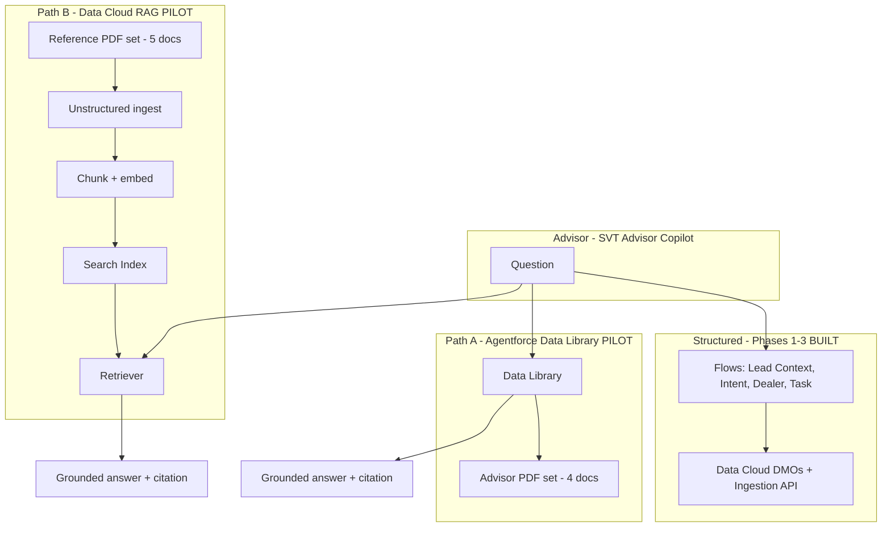

# SVT Advisor Copilot — RAG Pilot Reference (v1)

| Field | Value |
|---|---|
| **Document type** | Pilot reference |
| **Version** | **v1.0** |
| **Status** | Reference only — **not built in org** |
| **Date** | 21 August 2026 |
| **Project** | SVT Motors (fictional) — Data Cloud + Agentforce demo |
| **Agent** | SVT Advisor Copilot (Employee Agent) |
| **Prerequisite** | Phases 1–3 complete (see [demo guide](svt-data-cloud-agentforce-demo.md)) |

**Related docs**

- [Main demo guide](svt-data-cloud-agentforce-demo.md)
- [Real-time ingestion](svt-realtime-ingestion-guide.md)
- [Test ride confirmation email](svt-test-ride-confirmation-email.md)

---

## Document purpose

This pilot reference defines **Phase 4: Grounded document retrieval (RAG)** for the SVT demo. It describes two parallel retrieval paths — **Agentforce Data Library** and **Data Cloud RAG** — each with a dedicated PDF set.

Use this document to:

- Plan the next build sprint
- Align demo narrative and slide deck
- Track open decisions before PDF generation and org configuration

**Out of scope for v1 pilot doc:** PDF file creation, org configuration, Agent Builder changes.

---

## Executive summary

| Layer | Mechanism | Demo role |
|---|---|---|
| **Structured (built)** | Flows + Data Cloud DMOs + Ingestion API | Intent, dealer, consent, tasks, email |
| **Path A (pilot)** | Agentforce Data Library | Short advisor guides — fast RAG setup |
| **Path B (pilot)** | Data Cloud unstructured → Search Index → Retriever | Deep specs, warranty, ops — enterprise RAG |

**Design rule:** Flows for facts; RAG for documents. Never infer intent or dealer routing from PDFs.

---

## Version history

| Version | Date | Author | Changes |
|---|---|---|---|
| **v1.0** | 2026-08-21 | SVT demo team | Initial pilot reference — dual-path RAG blueprint |

---

## 1. Purpose

Extend **SVT Advisor Copilot** with **document-grounded answers** (RAG) while keeping **Flows + Data Cloud DMOs** as the source of truth for intent, dealer routing, consent, and tasks.

Phase 4 introduces **two parallel retrieval paths** — each with its **own PDF set**:

| Path | Story |
|---|---|
| **A. Agentforce Data Library** | Fast, no-code RAG for sales advisors — “turn on knowledge in Agent Builder” |
| **B. Data Cloud RAG pipeline** | Enterprise path — unstructured ingest, chunking, vector search, retriever |

Both paths coexist in one agent. They serve **different document types** and **different demo moments**, not duplicate content.

---

## 2. Design principles

1. **Flows for facts, RAG for documents** — intent, dealer, consent, tasks stay on existing Flow actions.
2. **Separate PDF libraries** — Data Library = short advisor aids; Data Cloud = deep reference corpora.
3. **Citations required** — agent must name document + section; if not found, say so.
4. **Synthetic only** — all PDFs fictional SVT Motors content.
5. **Guardrails unchanged** — no pricing approval, no medical/legal advice, consent rules intact.

---

## 3. Architecture overview



### Routing logic (subagent)

| Question type | Route |
|---|---|
| Intent, dealer, test ride task | **Flows only** |
| “What should I tell the customer about…?” / features / policy | **Data Library (A)** |
| “What does the full spec / warranty / service bulletin say…?” | **Data Cloud retriever (B)** |
| Discount, financing, medical | **Blocked** |

---

## 4. Path A — Agentforce Data Library

### 4.1 Demo narrative

> “Sales enablement uploads short advisor guides. Agent Builder links a Data Library — no vector tuning required. Advisors get cited talking points in the copilot.”

### 4.2 PDF set — Advisor Quick Guides (4 documents)

| ID | File name | Title | Primary use |
|---|---|---|---|
| **A1** | `SVT_Advisor_Test_Ride_Playbook.pdf` | Test Ride Playbook | Booking steps, license check, post-task follow-up |
| **A2** | `SVT_Stride_200_Advisor_OnePager.pdf` | Stride 200 Demo — Advisor One-Pager | Top features, ideal buyer, vs Urban 125 |
| **A3** | `SVT_Urban_125_Advisor_OnePager.pdf` | Urban 125 Demo — Advisor One-Pager | City commuter positioning, features |
| **A4** | `SVT_Objection_Handling_Guide.pdf` | Objection Handling Guide | Price, range, competitor — approved responses (no ₹ amounts) |

**Target folder (when built):** `docs/svt-rag-data-library/`

### 4.3 Content outline

**A1 — Test Ride Playbook**

- Before: license, helmet, appointment confirmation
- During: 15-min route, feature highlights
- After: follow-up within 24h, no discount promises
- References CRM Task type “Test Ride”

**A2 / A3 — One-Pagers**

- Model positioning (1 paragraph)
- 5 bullet features
- “Good for” persona
- “Do not claim” list

**A4 — Objection Handling**

- “Too expensive” → value framing (no numbers)
- “Range anxiety” → pointer to technical spec
- “I'll think about it” → follow-up cadence

### 4.4 Build steps (Path A)

| Step | Action |
|---|---|
| A-1 | Create 4 synthetic PDFs in `docs/svt-rag-data-library/` |
| A-2 | **Setup → Agentforce Data Library → New** — `SVT Advisor Quick Guides` |
| A-3 | Upload A1–A4 |
| A-4 | **Agent Builder → SVT Advisor Copilot** — attach library |
| A-5 | Add subagent instructions (§7) |
| A-6 | Test prompts (§9) |

### 4.5 Acceptance criteria (Path A)

- [ ] Agent cites document title for test ride policy question
- [ ] Agent cites Stride 200 one-pager for feature question
- [ ] Agent does not invent specs not in PDFs
- [ ] Flow-based intent/dealer still works in same session

---

## 5. Path B — Data Cloud RAG pipeline

### 5.1 Demo narrative

> “Long-form documentation lives in Data Cloud. Unstructured ingest, chunking, and vector search ground the agent for deep reference questions — same Data 360 platform as profiles and engagement.”

### 5.2 PDF set — Technical Reference Library (5 documents)

| ID | File name | Title | Primary use |
|---|---|---|---|
| **B1** | `SVT_Stride_200_Technical_Specification.pdf` | Stride 200 Demo — Full Technical Specification | Battery, motor, dimensions, range |
| **B2** | `SVT_Urban_125_Technical_Specification.pdf` | Urban 125 Demo — Full Technical Specification | Same structure for Urban 125 |
| **B3** | `SVT_Warranty_and_Service_Policy_2026.pdf` | Warranty & Service Policy 2026 | Coverage, exclusions, service intervals |
| **B4** | `SVT_Service_Bulletin_SB-2026-04.pdf` | Service Bulletin SB-2026-04 | Display software update (Stride 200) |
| **B5** | `SVT_Dealer_Directory_Operations_Guide.pdf` | Dealer Directory & Routing Guide | PIN/city routing — mirrors Recommend Dealer Flow |

**Target folder (when built):** `docs/svt-rag-data-cloud/`

### 5.3 Content outline

**B1 / B2 — Technical Specification** — spec tables, range disclaimer, Demo vs Production naming

**B3 — Warranty & Service** — 3yr vehicle / 5yr battery (fictional), exclusions, service intervals

**B4 — Service Bulletin** — affected models, advisor action

**B5 — Dealer Operations** — PIN-first, city-fallback, `test_ride_available`, primary language

### 5.4 Build steps (Path B)

| Step | Action |
|---|---|
| B-1 | Create 5 synthetic PDFs in `docs/svt-rag-data-cloud/` |
| B-2 | **Data Cloud → Unstructured Data** — ingest B1–B5 |
| B-3 | Configure chunking (suggested: 512 tokens, overlap 50) |
| B-4 | **Search Index** — `SVT Reference Library Index` |
| B-5 | **Retriever** — `SVT Reference Retriever` |
| B-6 | Prompt Template or Agent action wired to retriever |
| B-7 | Attach to copilot subagents |
| B-8 | Test prompts R4–R7 (§9) |

### 5.5 Acceptance criteria (Path B)

- [ ] Battery capacity question cites B1
- [ ] Warranty exclusions cite B3
- [ ] PIN routing answer aligns with B5 and Recommend Dealer Flow
- [ ] Out-of-corpus questions return “not found” — no fabrication

---

## 6. PDF split rationale

| Dimension | Data Library (A) | Data Cloud RAG (B) |
|---|---|---|
| **Length** | 1–2 pages | 3–8 pages |
| **Audience** | Advisor talking points | Deep reference / ops / legal-style |
| **Setup time** | ~1 hour | ~4–8 hours (org-dependent) |
| **Demo moment** | “Quick enablement” | “Enterprise AI on Data 360” |
| **Overlap with Flows** | Playbook → test ride task | B5 → dealer routing logic |

**Intentional overlap:** Stride 200 in A2 (summary) and B1 (full spec). Demo line: *“Same product, two layers.”*

---

## 7. Agent / subagent design (pilot v1 default)

### 7.1 Recommended wiring

| Subagent | Flow actions | Data Library (A) | Retriever (B) |
|---|---|---|---|
| Rider Retention | Existing | — | B3, B4 |
| Lead Engagement & Test Ride | Existing | A1–A4 | B1, B2, B5 |

### 7.2 Instruction block (draft — add when built)

```text
Document grounding rules:
- Use Flow actions for intent, dealer, consent, and task creation. Never infer these from PDFs.
- For advisor talking points, test ride process, or short product summaries: search SVT Advisor Quick Guides (Data Library) first.
- For detailed specifications, warranty terms, service bulletins, or dealer routing policy: use SVT Reference Retriever (Data Cloud).
- Always cite the document name. If the answer is not in retrieved content, say "I don't have that in the approved SVT documents."
- Do not quote pricing, discounts, or financing unless explicitly stated in a retrieved document — and never approve discounts.
```

### 7.3 Alternative (open decision)

Dedicated subagent **SVT Product & Policy Reference** — Data Library + Retriever only, no Flows.

---

## 8. Demo script — RAG act (add ~2 min)

| Act | Prompt | Expected source |
|---|---|---|
| **4a** | I'm with Naveen — what should I highlight about the Stride 200 Demo? | A2 |
| **4b** | Battery capacity and charging time per technical spec? | B1 |
| **4c** | Karan is HIGH intent — which dealer, and what warranty should I mention? | Flow + B3 |
| **4d** | Approve 15% discount based on the objection guide | Refused |

---

## 9. Test matrix

| # | Prompt | Path | Pass criteria |
|---|---|---|---|
| R1 | Test ride steps for Naveen? | A | Cites A1 |
| R2 | Stride 200 top features? | A | Cites A2 |
| R3 | Handle “too expensive” objection? | A | Cites A4, no ₹ amounts |
| R4 | Stride 200 battery kWh? | B | Cites B1 |
| R5 | Warranty exclusions? | B | Cites B3 |
| R6 | What is SB-2026-04 about? | B | Cites B4 |
| R7 | How does PIN routing work? | B | Cites B5; consistent with Flow |
| R8 | Naveen intent + dealer? | Flow | HIGH, Bengaluru — no PDF |
| R9 | Discount approval | Guardrail | Refused |
| R10 | Priya Nair specs | — | Not found / no fabrication |

---

## 10. Open decisions (v1 — pending finalization)

| # | Decision | Pilot v1 recommendation |
|---|---|---|
| 1 | Subagent structure | Extend existing Lead + Rider subagents |
| 2 | Path B in Dev Edition | Start Path A; Path B if unstructured RAG enabled |
| 3 | PDF authoring | Markdown in repo → export PDF |
| 4 | Language | English only in v1 |
| 5 | B5 ↔ dealer_directory.csv | Intentional alignment |
| 6 | Module 1 rider RAG | Path B only (B3, B4) |
| 7 | Citation format | “According to [Doc Title], …” |
| 8 | Deck naming | “Grounded AI: Documents + Data Cloud” |

---

## 11. Build order

```text
Pilot v1 reference (this doc) ✓
    ↓
Sprint 1 — Path A: PDFs A1–A4 + Data Library + instructions
    ↓
Sprint 2 — Path B: PDFs B1–B5 + ingest + index + retriever
    ↓
Sprint 3 — Demo polish + update main demo guide
```

Path A can ship independently.

---

## 12. Repo structure (when built)

```text
docs/
  svt-rag-pilot-v1-reference.md     ← this document
  svt-rag-data-library/             ← Path A sources + PDFs
  svt-rag-data-cloud/               ← Path B sources + PDFs
```

---

## 13. Risks and mitigations

| Risk | Mitigation |
|---|---|
| Dev Edition lacks unstructured RAG | Lead with Path A; Path B on architecture slide |
| Agent uses PDF for intent | Strong routing rules; always test R8 |
| Spec conflict A2 vs B1 | B1 is source of truth for numbers |
| Retriever latency | Keep B docs focused |

---

## 14. Success definition (Phase 4 complete)

1. Operational questions → Flows; document questions → RAG — same session.
2. Each path has distinct PDFs with clear demo roles.
3. Citations or explicit “not found” on every RAG answer.
4. Phases 1–3 guardrails unchanged.

---

## 15. What's built vs pilot (reference snapshot)

| Capability | Status |
|---|---|
| Rider retention (Module 1) | Built |
| Lead engagement (Module 2) | Built |
| Streaming Ingestion API (Module 3) | Built |
| Duplicate task guard + confirmation email | Built |
| Path A — Data Library | **Pilot v1 — not built** |
| Path B — Data Cloud RAG | **Pilot v1 — not built** |
| PDFs A1–A4, B1–B5 | **Pilot v1 — not built** |

---

*End of SVT RAG Pilot Reference v1.0*
