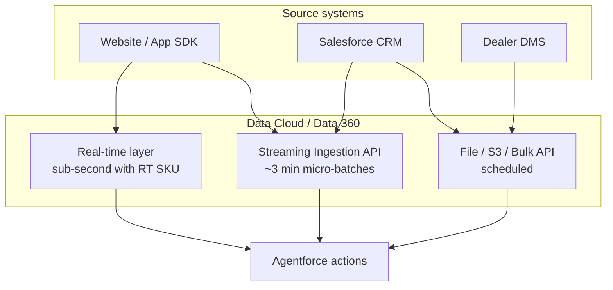

# SVT demo — real-time ingestion guide

This guide explains how the synthetic CSV sources in the SVT Advisor Copilot demo would be fed in a **production** org, and how to extend the demo with **near-real-time** engagement ingestion using the **Data Cloud Ingestion API**.

Related: [SVT Motors Data Cloud + Agentforce demo](svt-data-cloud-agentforce-demo.md)

---

## 1. Map demo CSVs to production sources

| Demo file | Production source | Typical latency | Ingestion pattern |
|---|---|---|---|
| `riders.csv` | Salesforce CRM (Contact), dealer portal, MDM | Minutes | CRM connector / scheduled sync |
| `prospects.csv` | Lead capture form, web SDK profile, CRM Lead | Seconds–minutes | Web/Mobile SDK + CRM connector |
| `digital_engagement.csv` | Website, mobile app, Marketing Cloud | **Sub-second to seconds** | Web SDK, Mobile SDK, Ingestion API |
| `lead_intent_events.csv` | Same as engagement (prospect journey) | **Sub-second to seconds** | Web SDK, Ingestion API |
| `vehicle_service_history.csv` | Dealer DMS, service workshop system | Hours (often nightly) | S3, MuleSoft, API bulk, Ingestion API batch |
| `dealer_directory.csv` | Dealer master / reference MDM | Daily or on change | File upload, API, MDM sync |

**Key idea:** only **behavioral events** (engagement) need true streaming for the agent story. Profiles and service history are usually batch or near-real-time.

---

## 2. Three latency tiers in Data Cloud



| Tier | Mechanism | Demo equivalent | Agent impact |
|---|---|---|---|
| **Real-time** | Web/Mobile SDK or Ingestion API + **real-time data graph** | Prospect clicks “Test ride” → agent sees it in seconds | Intent score updates on next agent turn |
| **Near-real-time** | **Streaming Ingestion API** (async ~3 min) | Server posts event after form submit | Good enough for most sales copilot demos |
| **Batch** | File upload, S3, scheduled connector | Your current CSV streams | Fine for profiles, DMS, dealer directory |

Developer Edition may **not** include the Sub-Second Real-Time Profile SKU. Streaming Ingestion API is the most realistic extension path for this demo org.

---

## 3. Production flow — engagement event (e.g. TestRideRequested)

This replaces a row in `lead_intent_events.csv` or `digital_engagement.csv`.

```text
1. User action on website/app
      ↓
2. Web SDK or your backend calls Ingestion API
      ↓
3. Event lands in Ingestion API DLO
      ↓
4. Mapping → Website Engagement DMO (same as demo)
      ↓
5. Identity resolution links Individual (LEAD-2001 / SVT-1001)
      ↓
6. SVT Get Lead Intent / upgrade readiness Flow reads new event
      ↓
7. Agentforce agent reflects updated intent on next question
```

**Fields to send (match your demo mapping):**

| Payload field | DMO field |
|---|---|
| `event_id` | Website Engagement Id |
| `prospect_id` or `customer_id` | Individual |
| `event_timestamp` | Engagement Date Time |
| `event_type` | SVT Event Type |
| `model` | SVT Model |

---

## 4. Production flow — profile updates (prospect / rider)

| Change | Source | Path |
|---|---|---|
| New Lead in CRM | Web-to-Lead, API | CRM connector → Contact/Lead objects; optional sync to Individual |
| Preferred model, consent | Form fields | Map to Individual custom fields (SVT Preferred Model, SVT Contact Permission) via Ingestion API or CRM enrichment |
| Email / phone change | CRM edit | CRM connector or CDC → Contact Point Email/Phone |

For the SVT demo, **email** is the join key between CRM Lead and Data Cloud Individual (via Contact Point Email → Party).

---

## 5. What you built vs what production adds

| Capability | Current demo (CSV) | Production |
|---|---|---|
| Engagement events | Manual file upload | SDK / Ingestion API stream |
| Profile attributes | `prospects.csv` upload | CRM connector + form SDK |
| Intent scoring | Flow reads Website Engagement | Same Flow — reads live stream |
| Agent | Unchanged | Unchanged — actions stay the same |
| Refresh schedule | None (static until re-upload) | Continuous streaming or scheduled sync |

**Important:** your Agentforce Flows and subagent do **not** need to change. Only the **data stream connector** changes from File Upload to Ingestion API or SDK.

---

## 6. Hands-on extension — Phase 1 (recommended start)

Add a **Streaming Ingestion API** data stream for engagement events, mapped to the same **Website Engagement** DMO as `lead_intent_events.csv`.

### Step 1 — Create Ingestion API connector (required before Data Streams)

**Ingestion API does not appear under Data Streams → New until this step is done.**

1. Open **Setup** (gear icon) — not the Data Cloud app tab alone.
2. Search **Ingestion API**, or go to **Data Cloud Setup → Salesforce Integrations → Ingestion API**.
   - Some orgs: **Setup → External Integrations → Ingestion API**
3. Click **New** and name the connector, e.g. `SVT_Engagement_Events`.
4. Click **Save**.
5. On the connector detail page, click **Upload Schema**.
6. Upload [`svt_engagement_events_schema.yaml`](svt-demo-data/svt_engagement_events_schema.yaml) from this repo.
7. Wait for status **Needs Data Stream** (or **In Use** after stream is deployed).

Now go to **Data Cloud → Data Streams → New** — **Ingestion API** should appear.

If it still does not appear:
- Confirm you are a Data Cloud admin.
- Refresh the page after schema upload.
- Check **Setup → Ingestion API** shows the connector with uploaded schema and object `engagement_event`.

### Step 2 — Create the data stream

1. **Data Streams → New → Ingestion API → Next**
2. Select connector `SVT_Engagement_Events` and object **`engagement_event`**
3. Category: **Engagement**
4. Primary key: **`event_id`**
5. Event time field: **`event_timestamp`**
6. Deploy to **default** data space

### Step 3 — Map to Website Engagement DMO

Use the **same mapping** as `lead_intent_events.csv`:

| API field | Website Engagement field |
|---|---|
| `event_id` | Website Engagement Id |
| `prospect_id` | Individual |
| `event_timestamp` | Engagement Date Time |
| `event_type` | SVT Event Type |
| `model` | SVT Model |

Deploy the stream.

### Step 4 — Post a test event

Use the object endpoint from Ingestion API setup (Postman, curl, or a small script). Example payload shape:

```json
{
  "event_id": "LEAD-EVT-9001",
  "prospect_id": "LEAD-2002",
  "event_type": "TestRideRequested",
  "event_timestamp": "2026-08-19T16:00:00Z",
  "model": "SVT Stride 200 Demo",
  "channel": "Web"
}
```

Wait for streaming processing (~3 minutes for standard Streaming Ingestion API, or sub-second if real-time data graph + SKU are enabled).

### Step 5 — Verify

1. **Data Explorer → Website Engagement** — new row for Karan (`LEAD-2002`).
2. Debug **SVT Get Lead Intent** with `prospectId = LEAD-2002` — should move from **MEDIUM** to **HIGH**.
3. Ask the agent: *“What’s Karan Singh’s intent now?”*

---

## 7. Phase 2 — CRM Lead sync (profile path)

1. **Data Streams → New → Salesforce CRM**.
2. Select **Lead** (and optionally **Contact** for riders).
3. Map standard fields; use **Data Cloud-triggered enrichment** or a separate process to keep Individual custom fields (preferred model, consent) in sync.
4. Schedule: continuous or every 15–60 minutes depending on org.

This replaces re-uploading `prospects.csv` when a Lead is created or updated in CRM.

---

## 8. Phase 3 — Real-time data graph (production SKU)

If the org has **Sub-Second Real-Time Profile & Entities**:

1. Create a **real-time data graph** including **Individual** and **Website Engagement**.
2. Add the Ingestion API DMO to the graph.
3. Enable **Real-Time Data Ingestion** on the graph.
4. Use **Web SDK** on a demo landing page for browser-native capture.

Events can then power real-time segmentation, calculated insights, and Agentforce within ~500 ms (per Salesforce documentation; varies by org).

---

## 9. Phase 4 — Marketing Cloud (optional)

For the TVS/SVT story alignment with **Marketing Cloud**:

- Email opens, clicks, journeys → Data Cloud **Marketing Engagement** or mapped engagement DMO.
- In the demo, `EmailOpened` in CSV simulates this without MC provisioned.

---

## 10. Demo script addition — “live event”

After Phase 1 is working:

1. Show Karan as **MEDIUM** in the agent.
2. Post a `TestRideRequested` event via Ingestion API for `LEAD-2002`.
3. Wait for processing.
4. Re-ask the agent — Karan should now be **HIGH**.
5. Narrate: *“Same Flow and agent; only the data pipe changed from CSV to streaming API.”*

---

## 11. Sources

- [Real-Time Ingestion (Data 360)](https://developer.salesforce.com/docs/data/data-cloud-int/references/data-cloud-ingestionapi-ref/c360-a-real-time-ingestion-api.html)
- [Streaming Ingestion API](https://developer.salesforce.com/docs/data/data-cloud-int/references/data-cloud-ingestionapi-ref/c360-a-api-streaming-ingestion.html)
- [Trailhead — Real-Time Features in Data Cloud](https://trailhead.salesforce.com/content/learn/modules/real-time-use-cases-in-data-cloud/explore-real-time-features-in-data-cloud)
- [Salesforce blog — Real-Time Ingestion and Actions](https://www.salesforce.com/blog/real-time-ingestion/)
