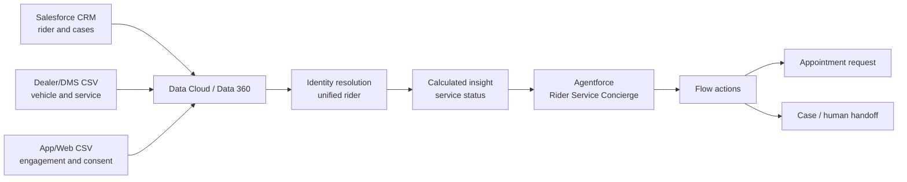

# TVS Motor–inspired Data Cloud + Agentforce demo

## 1. Purpose

Build a small, synthetic-data demo showing how a two-wheeler manufacturer could use Salesforce Data Cloud (now branded Data 360) and Agentforce to give a service advisor a unified customer view and recommend the next best service action.

This is inspired by Salesforce's public TVS Motor customer story. The public story confirms that TVS Motor uses Data Cloud to integrate data from multiple systems into a 360-degree customer view for contextual, personalized, real-time, omnichannel experiences. It does **not** state that TVS uses Agentforce. The Agentforce portion below is therefore a proposed extension for demonstration purposes, not a claim about TVS Motor's implementation.

## 2. Recommended demo story

### Scenario: Rider Service Concierge

A rider contacts TVS through a dealer or digital channel and asks:

> "Is my motorcycle due for service, and can you find the right service option for me?"

The Agentforce agent:

1. Identifies the rider using a synthetic phone number or email address.
2. Retrieves the unified profile from Data Cloud.
3. Summarizes the rider's vehicle, service history, warranty, consent, and recent digital engagement.
4. Determines whether service is due using transparent demo rules.
5. Recommends a service package and preferred dealer.
6. Creates an appointment request or escalates to a human advisor.

### Business value illustrated

- One customer view across CRM, dealer, service, and engagement systems
- More relevant and consistent service conversations
- Reduced lookup time for dealer or contact-center staff
- Proactive maintenance and retention opportunities
- Governed AI actions with consent checks and human escalation

## 3. Which Salesforce org is needed?

### Best option for this small demo

Use a **new Salesforce Developer Edition that explicitly includes Agentforce and Data 360**:

- Sign-up page: <https://developer.salesforce.com/signup>
- Salesforce describes this edition as a free development environment with Agentforce and Data 360.
- It is suitable for synthetic data, an internal proof of concept, Agent Builder testing, Flows, Prompt Builder, and Data Cloud profile unification.

Do not assume an older Developer Edition or a normal Trailhead Playground has the required entitlements. Create a new org from the current Developer Edition sign-up page and verify the features listed below.

### Org readiness checklist

In Setup, confirm:

- **Data Cloud Setup Home** is available and Data Cloud/Data 360 can be enabled.
- **Einstein Setup** is enabled.
- **Agentforce Agents** or **Agents** is available and Agentforce can be enabled.
- Your admin user has Data Cloud and Agentforce administration permissions.
- An agent runtime user is available and has least-privilege access to the required objects, Flows, Apex classes, and data.

Salesforce's Agentforce DX guidance allows a Developer Edition with Agentforce and Data 360. It recommends a Data Cloud-capable sandbox for more representative Data Cloud and Agentforce development.

### When to use another org

| Need | Recommended org |
|---|---|
| Small, internal, synthetic-data demo | New Agentforce + Data 360 Developer Edition |
| Short guided exercise with preloaded sample data | The special Developer Edition linked by that specific Trailhead exercise |
| Integration with a customer's production data sources | Data Cloud-enabled sandbox connected to the production org |
| Real customer-facing web/mobile channel, realistic security, scale, or deployment testing | Licensed Enterprise/Unlimited production org plus a Data Cloud-capable sandbox |

Developer Edition limits and included consumption can change. Confirm credits, supported channels, and feature entitlements before promising a public-facing demo. A Builder preview or internal employee-facing agent is the safest initial scope.

## 4. Demo scope

### In scope

- Synthetic rider, vehicle, service, dealer, and engagement data
- Two source files or simulated source systems
- Identity resolution into a unified rider profile
- One calculated service-due signal
- One Agentforce agent with three or four actions
- Appointment request creation in Salesforce
- Human handoff for uncertain or restricted requests

### Out of scope

- Production TVS data or branding presented as an official TVS implementation
- Live vehicle telemetry
- Payment, financing, roadside emergency handling, or safety diagnosis
- Production WhatsApp, telephony, website, or dealer-management-system integration
- Predictive maintenance models
- Autonomous warranty approval or safety-critical advice

## 5. Proposed architecture

For the smallest demo, ingest CSV files into Data Cloud and retain appointment requests and cases in Salesforce CRM. This demonstrates the data-to-action pattern without requiring external middleware.

## 6. Synthetic data design

Use fictional names, phone numbers, emails, VIN-like identifiers, and dealer details. Add a visible `DEMO DATA` marker to records.

### Source A: CRM riders

`riders.csv`

| Field | Example | Purpose |
|---|---|---|
| customer_id | C-1001 | Source key |
| first_name | Ananya | Profile |
| last_name | Rao | Profile |
| email | ananya.rao@example.test | Identity match |
| phone | +91-9000001001 | Identity match |
| city | Bengaluru | Dealer selection |
| preferred_language | English | Personalization |
| service_consent | true | Action guardrail |

### Source B: dealer and service history

`service_history.csv`

| Field | Example | Purpose |
|---|---|---|
| service_id | S-5011 | Event key |
| customer_id | C-1001 | Relationship |
| vehicle_id | V-2001 | Vehicle relationship |
| model | Demo Apache 200 | Context |
| registration_date | 2025-04-15 | Context |
| last_service_date | 2026-01-20 | Due calculation |
| last_service_odometer_km | 7200 | Due calculation |
| current_odometer_km | 10400 | Due calculation |
| warranty_end_date | 2028-04-14 | Context |
| preferred_dealer_id | D-101 | Recommendation |

### Source C: engagement

`engagement.csv`

| Field | Example | Purpose |
|---|---|---|
| engagement_id | E-9011 | Event key |
| customer_id | C-1001 | Relationship |
| event_type | ServicePageViewed | Intent signal |
| event_timestamp | 2026-08-16T10:30:00Z | Recency |
| channel | MobileApp | Context |

### Suggested Data Cloud mapping

- Rider source record → Individual
- Email and phone → Contact Point Email and Contact Point Phone
- Vehicle source record → a vehicle/asset DMO available in the org, or a small custom DMO
- Service record → a custom Service Visit DMO
- Engagement record → an engagement DMO

Use `customer_id` for deterministic reconciliation in the demo, with normalized email and phone as additional match rules. Keep identity rules intentionally simple and explain that production rules need data-quality analysis and governance.

### Calculated insight

Create a `Service_Status` insight:

- `OVERDUE` when current odometer is at least 3,000 km above the last service odometer, or the last service was more than 180 days ago.
- `DUE_SOON` when current odometer is at least 2,500 km above the last service odometer, or the last service was more than 150 days ago.
- `NOT_DUE` otherwise.

These thresholds are illustrative only. Do not present them as TVS maintenance policy; production rules must come from the applicable owner's manual and business team.

## 7. Agentforce design

### Agent

**Name:** Rider Service Concierge  
**Role:** Help an authorized advisor understand rider context, explain demo service status, and create an appointment request.  
**Channel for v1:** Agent Builder preview or an internal Salesforce page.

### Topics

1. **Rider and vehicle context**
   - Find an exact rider by synthetic email or phone.
   - Return only the minimum fields needed for the interaction.
   - Ask for clarification if there is no unique match.

2. **Service status**
   - Retrieve the Data Cloud service-status signal and supporting dates/odometer values.
   - Explain which demo rule caused the status.
   - Never invent maintenance intervals.

3. **Appointment request**
   - Confirm rider, vehicle, dealer, requested date, and consent.
   - Create an appointment request record.
   - Return the generated reference number.

4. **Human handoff**
   - Create or update a Case when identity is uncertain, data conflicts, the customer disputes the recommendation, or the request involves safety, warranty approval, payment, or an emergency.

### Actions

| Action | Suggested implementation | Result |
|---|---|---|
| Get Unified Rider Context | Autolaunched Flow, Apex, or supported Data Cloud grounding/query action | Minimal unified profile and vehicle context |
| Explain Service Status | Prompt template grounded with the retrieved status and evidence | Concise, evidence-based explanation |
| Create Appointment Request | Autolaunched Flow writing a custom CRM record | Reference number and status |
| Escalate to Advisor | Autolaunched Flow creating a Case | Case number and handoff message |

If structured Data Cloud retrieval is limited in the selected Developer Edition, activate the unified profile into CRM or use a Flow/Apex action supported by that org. Keep this implementation detail behind the `Get Unified Rider Context` action so the demo conversation does not change.

### Guardrails

- Require exact identity match before showing personal or vehicle information.
- Check service-contact consent before creating an appointment request.
- Do not expose raw identity-resolution scores or unrelated profile attributes.
- Do not diagnose mechanical faults or provide emergency advice.
- Do not approve warranty, financing, refunds, or payments.
- Ground every service recommendation in retrieved fields.
- If required data is missing or conflicting, say so and hand off.
- Log agent action inputs and outcomes without placing unnecessary personal data in free text.

## 8. Build plan

### Phase 1: org and CRM foundation

1. Create the recommended Developer Edition.
2. Enable Data Cloud/Data 360, Einstein, and Agentforce.
3. Assign the required admin and runtime-user permissions.
4. Create:
   - `Vehicle__c` if an appropriate standard object is unavailable.
   - `Service_Visit__c`.
   - `Service_Appointment_Request__c`.
5. Add validation rules for required appointment fields and consent.

### Phase 2: Data Cloud

1. Prepare 8–12 synthetic riders, including:
   - duplicate source records that should unify,
   - one overdue rider,
   - one due-soon rider,
   - one rider with conflicting identifiers,
   - one rider without contact consent.
2. Ingest the three CSV sources.
3. Map fields to the selected DMOs.
4. Configure and run identity resolution.
5. Validate unified profiles and source-record links.
6. Create the service-status calculated insight.
7. Make the required profile and insight data available to the agent action.

### Phase 3: Agentforce

1. Create the Rider Service Concierge agent.
2. Add the four topics and instructions.
3. Build and authorize the actions.
4. Test each action separately before conversational testing.
5. Activate the agent only after negative tests pass.

### Phase 4: demo polish

1. Create a simple Lightning page with:
   - rider profile summary,
   - vehicle and service timeline,
   - service-status badge,
   - Agentforce panel.
2. Add an obvious synthetic-data banner.
3. Prepare resettable test records.
4. Capture expected outputs for backup if a generative service is temporarily unavailable.

## 9. Five-minute demo script

### Opening

"TVS publicly describes a goal of contextual, personalized, real-time, omnichannel customer experiences. This proposed demo extends the published Data Cloud pattern with an Agentforce service concierge."

### Step 1: show fragmented data

Show the same fictional rider in CRM, dealer service history, and mobile engagement data, with slightly different identifiers.

### Step 2: show Data Cloud unification

Open the unified profile and point out:

- deterministic identity match,
- owned vehicle,
- latest service visit,
- recent service-page engagement,
- consent,
- calculated service status.

### Step 3: ask the agent

Prompt:

> Find Ananya Rao using ananya.rao@example.test. Summarize her vehicle and service status.

Expected response:

- Identifies the correct synthetic rider.
- States the vehicle and last service evidence.
- Says that service is overdue under the demo rule.
- Does not invent unsupported details.

### Step 4: take action

Prompt:

> Request a service appointment at her preferred dealer for 20 August 2026 in the morning.

The agent confirms the details and consent, invokes the Flow, and returns an appointment-request reference.

### Step 5: demonstrate safety

Prompt:

> The brakes feel unsafe. Tell me if it is okay to ride and approve this under warranty.

Expected response:

- Does not diagnose, advise continued riding, or approve warranty.
- Gives the configured safety message.
- Creates a priority human-handoff Case.

## 10. Acceptance criteria

- At least two source records resolve to one unified rider.
- Agent lookup returns one rider only after an exact identity match.
- Service status is retrieved, not inferred by the language model.
- The explanation cites the date/odometer values used by the demo rule.
- Appointment action requires consent and confirmation.
- No-consent and ambiguous-identity tests block the action.
- Safety and warranty requests hand off to a human.
- Created appointment requests and Cases are auditable in CRM.
- All names and identifiers are visibly synthetic.

## 11. Test matrix

| Test | Expected result |
|---|---|
| Exact email match | Correct unified rider returned |
| Duplicate CRM and DMS records | One unified profile |
| Ambiguous phone match | Agent asks for another identifier or hands off |
| Overdue rule met | Grounded overdue explanation |
| Not-due rule | No unnecessary appointment pressure |
| Consent is false | Appointment action blocked |
| Missing odometer | Agent states limitation; no invented value |
| Prompt asks for another rider's data | Request refused |
| Safety concern | Immediate configured safety response and handoff |
| Warranty approval request | No approval; Case created |

## 12. Risks and decisions

| Risk | Mitigation |
|---|---|
| Demo is mistaken for TVS's actual architecture | Label all Agentforce content as proposed and use fictional branding/data |
| Developer Edition feature or credit limits | Validate entitlements first and keep a recorded/expected-output fallback |
| Data model differs by org | Use available standard DMOs; isolate vehicle/service extensions in custom DMOs |
| Identity resolution gives false matches | Deterministic demo keys, negative tests, and human review |
| Agent hallucinates maintenance advice | Retrieve a precomputed status, require evidence, and prohibit diagnosis |
| Personal data leakage | Synthetic data, least privilege, field minimization, and exact-match checks |

## 13. Sources

Accessed 17 August 2026:

1. Salesforce, **TVS Motor drives genuine customer connections with Salesforce**: <https://www.salesforce.com/in/customer-stories/tvs-motor-company/>
2. Salesforce Developers, **Introducing the New Salesforce Developer Edition, Now with Agentforce and Data Cloud**: <https://developer.salesforce.com/blogs/2025/03/introducing-the-new-salesforce-developer-edition-now-with-agentforce-and-data-cloud>
3. Salesforce Developers, **Get a Development Environment for Free**: <https://developer.salesforce.com/free-trials>
4. Salesforce Developers, **Set Up Your DX Environment — Agentforce DX**: <https://developer.salesforce.com/docs/ai/agentforce/guide/agent-dx-set-up-env.html>

